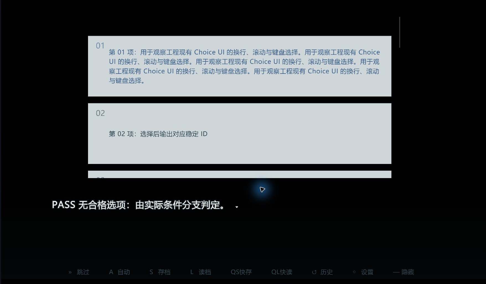
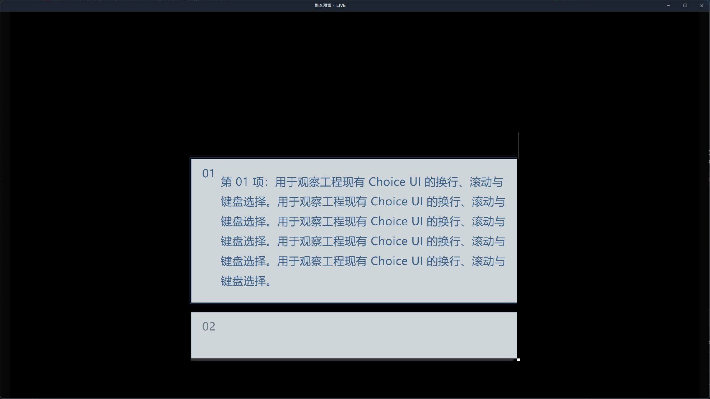
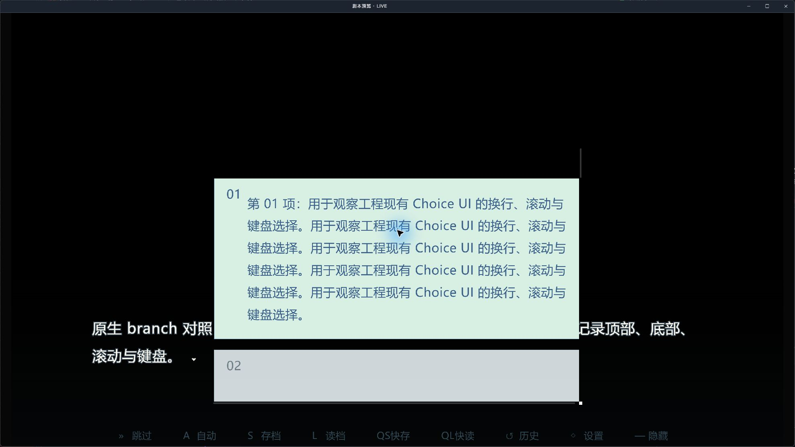

# 玩家选项界面的兼容与排查

适用插件：3.0.0；历史图片按各自版本保留。本文说明项目选项界面的布局处理，不提供新皮肤，不替换项目绑定。

## 显示不完整时先检查什么

本插件通过官方 Choice 插槽传递候选文字、可用状态和原始序号，项目绑定决定显示哪份界面。检查面板可查看宿主返回的 Choice 绑定；返回默认或 UNKNOWN 时，应在个性化的游戏系统设置中核对。不要因为工程里有同名文件就认定它正在生效。

在 Studio 2.3.0-beta.1 的合成工程中，12项选项的前几项不可滚动到达；同工程的官方分支和 Windows 导出播放器也复现。该版本播放器的选项列表使用居中排列和滚动。内容高于容器时，居中可能把前几项放到滚动起点之前。这是已观察到的布局限制，不能据此推断所有宿主或所有自定义界面都受影响。

## 可以自己编排 UI 吗

可以。玩家看到的选项使用工程绑定的官方 Choice 界面，插件提供候选文字和选择结果。在 Studio 2.4.0-beta.2 中进入“个性化→选项”，核对当前绑定，再点“在 UI 编辑器中编辑”。合成示例的图层包含“选项列表_故事分支”“选项按钮框体_模板”“选项正文_模板”、序号和装饰线。

在项目副本中调整位置、尺寸、字体、颜色和装饰；保留列表类型、组件ID、正文数据绑定与选择回调。UI编辑器将这份项目界面标为“已自定义”。同一个绑定会同时影响官方branch和插件玩家选项，因此两者都要验证。修改外观不会增加候选、改变条件或调整权重，这些仍在插件配置及剧本方法中处理。

## 项目级兼容调整

先备份正在使用的界面。只在需要修改的项目副本中操作；系统和市场原件保持原样。保留项目绑定、原组件ID、文字、按钮回调与装饰。选择“选项列表”组件，在其自定义CSS中追加以下规则，保留已有内容：

```css
& [role="menu"][aria-label="剧情选项"] {
  justify-content: flex-start !important;
  justify-content: safe center !important;
}
```

支持 `safe center` 的环境在内容放得下时仍居中，溢出时从首项开始；第一行是安全的靠前排列后备值。规则只作用于该列表的菜单。它不会压缩字体、隐藏候选或改变选择结果。

这段规则只处理列表起点。若单条长文字仍被裁切，需要同时调整“选项按钮框体”和“选项正文”的高度，保留正文在按钮内的相对位置；不能只拉高整个列表。以最长实际文案核对换行、键盘焦点和鼠标点击。自定义React选项界面需在其自身可滚动容器上实现同样的安全排列，不套用未知结构的CSS选择器。

## rc.5 在2.4.0-beta.2中的编排实例

原项目绑定仍为默认游戏壳的剧情选项，编辑的是该工程的覆盖界面；“绑定为默认”与“项目覆盖已自定义”可以同时成立。先在“个性化→游戏系统”确认Choice，再进入“个性化→选项→在UI编辑器中编辑”。

在本合成工程的1920×1080画布中，将选项列表设置为1240×640、X=340、Y=40，按钮1200×240，正文1080×238、字号25、行高1.5。保留原图层ID、列表数据绑定、点击回调和安全排列规则。保存后单项不遮挡对白，首项长文四行完整，列表没有横向条，滚轮和End／Enter可到达第12项并选择。固定尺寸不自动适应任意文案，其他画布需自行核对。

该次布局实测使用rc.5早期运行字节，后续仅修复抽空及旧方法失败输出；该图片不是后续运行文件的完整导出验证。本插件不会把上述尺寸写入其他工程，也不提供新皮肤。



仅裁取游戏画面，来源与校验值见images/PROVENANCE.md。

## 历史验收范围

必须分别验证：少量短选项、首项长文、12项以上滚动、首末项点击、键盘Home/End或方向键、无合格候选，以及存读档后再选择。文字相同但候选ID不同的选项也要验证。插件返回成功不代表全部按钮都可见。

2026-10-01在Studio 2.3.0-beta.1、插件3.0.0-rc.2的同一合成工程完成限定验证：安全排列使首项重新可达；滚动与Home/End能到达12项首尾；选项选择后的真实条件断言确认只消耗一份。官方branch使用同一UI，长文和末项键盘选择通过。

长文另在UI编辑器将按钮框体高度76调为400、正文74调为398、列表410调为640，保留字体与绑定。该组值仅是该长文样本的固定布局：短选项也会变高，并非自动适配任意长度。应按自己的最长文案、分辨率和对话框遮挡重新排版。




展示中保存到合成工程空槽，选择后读回，12个候选及24份恢复；改选第一项后剩余／可用23、待选记录清空。本项不覆盖关闭、导航、过期回调的全部组合。截图来源、版本和校验值见images/PROVENANCE.md，完整范围见VALIDATION-3.0.md。

2026-10-02，插件rc.4在Studio 2.4.0-beta.1及其新Windows x64导出播放器沿用该项目绑定：长文完整可见、End到达第12项并选择、只消耗一份通过。Studio展示中存读档及播放器展示中存档跨进程恢复、继续确认与调整通过。新播放器仍显示列表横向滚动条及对话叠加，布局需要按作品分辨率进一步优化；不能将大按钮验收尺寸当推荐皮肤。

上述是历史同一合成工程的限定结果。rc.5已补当前Beta过期、同请求重开、双击、调度回放及等待取消测试，详见VALIDATION-3.0；其他主题和Stable仍须分别验收。新播放器原图随人类手册提供，版本及校验值见来源说明。

资料依据：[官方系统插槽与选项契约](https://docs.avg-engine.com/extensions/system-slots)、[CSS 安全对齐说明](https://developer.mozilla.org/en-US/docs/Web/CSS/Reference/Properties/justify-content)。
