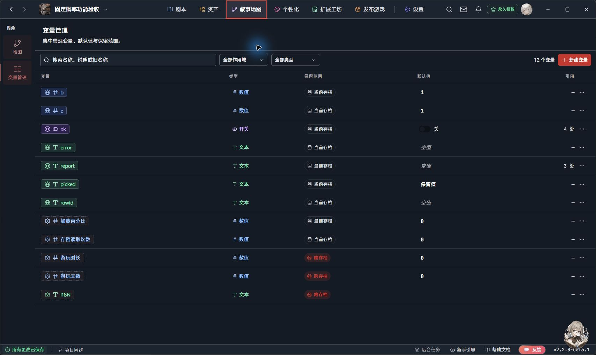
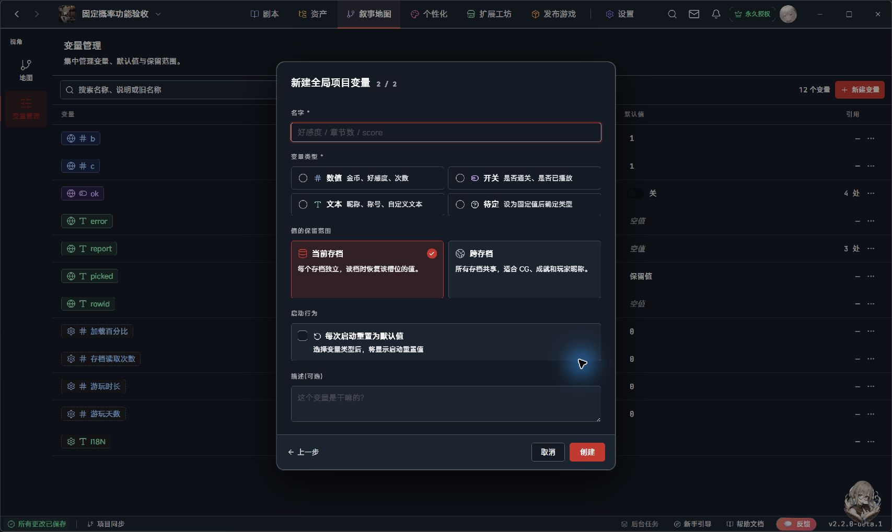
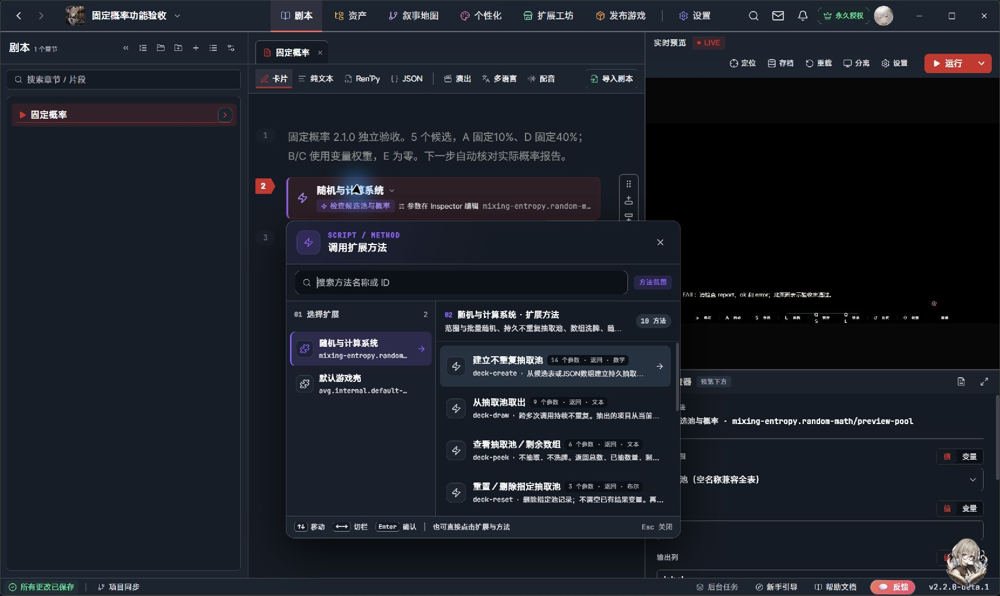
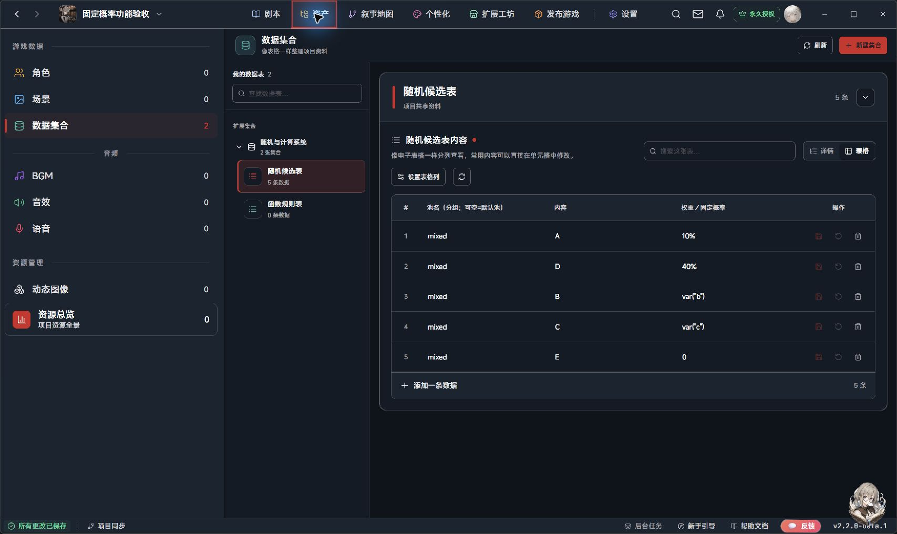

# 随机与计算系统 · 创作者使用手册

**从第一次掷骰，到一整轮不重复事件。**

适用插件：随机与计算系统 2.2.1 · 手册修订：2026-09-28 · 界面参考：LetsGal Studio 2.2.0-beta.1。

这份手册供使用 LetsGal 制作游戏的人阅读。你只需要在编辑器里建立变量、添加方法卡片、填写参数，无须阅读或编译插件源码。先完成第 2、3 章，再按需要查后面的功能。

## 1. 这个插件能做什么

它为剧本提供随机抽取和数学计算：掷骰、概率事件、奖励数值、抽卡、事件轮换和公式计算。**它算出结果，并按你的设置存进变量；接下来显示哪段对白、跳到哪个片段、发什么奖励，由你的剧本安排。**

| 你想做的事 | 选择的功能 | 是否需要表格 |
|---|---|---|
| 在 1～6 之间掷骰，或生成小数 | 随机数 | 不需要 |
| 一次生成几个数字 | 随机数，数量大于 1 | 不需要 |
| 第一次抽定，此后沿用该结果 | 随机数 → 首次抽取后固定 | 不需要 |
| 从几个事件中抽一个，或按权重抽多个 | 列表随机（安科式） | 随机候选表 |
| 按不同概率抽金额、伤害或公式结果 | 列表随机（数值／公式） | 随机候选表 |
| 本轮抽过的内容，在后面的调用中也不再出现 | 建立不重复抽取池 → 从抽取池取出 | 可直接填数组 |
| 查看本轮还剩什么、开始新一轮 | 查看抽取池／剩余数组、重置／删除指定抽取池 | 不需要额外表格 |
| 加减乘除、开平方、取整 | 计算 | 不需要 |
| 复用自定义公式，例如计算伤害 | 计算 → 自定义函数 | 函数规则表 |
| 看候选实际概率，检查配置 | 检查候选池与概率 | 随机候选表 |

“安科式”在这里指从候选列表中抽取文字。没有接触过安科也可以使用。

### 1.1 先认清这些词

第一次使用不用背参数名。遇到不认识的词，可搜索它并打开“结果与预览”，或回到这张对照表。

| 名词 | 用普通话解释 | 例子／注意 |
|---|---|---|
| <span id="term-host">宿主</span> | 运行插件的软件，本手册指 LetsGal Studio 或导出的游戏播放器 | 编辑器里看到按钮，不代表播放器已经测试通过 |
| <span id="term-method">方法／调用</span> | 插件提供的一项操作；让它执行一次叫调用 | “随机数”是方法，执行一次得到一个数 |
| <span id="term-card">方法卡片／检查器</span> | 剧本里执行操作的卡片；编辑卡片参数的面板 | 选中卡片后，在检查器填最小值、最大值 |
| <span id="term-parameter">参数／默认值</span> | 告诉操作怎样执行的设置；默认值是未修改前的设置 | 最大值6是参数，不是已经抽到6 |
| <span id="term-variable">变量／变量类型</span> | 有名字的存储格子；类型决定存数字、文字还是开关 | roll存数值，picked存文本，ok存开关 |
| <span id="term-boolean">开关／布尔</span> | 只有开、关两种值 | true是开，false是关；成功状态用开关 |
| <span id="term-branch">片段／条件分支</span> | 一段剧情；根据条件选择接下来执行哪段的操作 | 抽中“调查”后，由你连接调查片段 |
| <span id="term-feedback">反馈</span> | 某段操作结束后修改状态，让后续行为变化 | 调查结束将“可调查”改为0，下次不再抽到 |
| <span id="term-table">数据集合／表／行／列</span> | 一张数据表；一行是一条候选，一列是一种信息 | “调查、daily、5”是一行；内容、池名、权重是列 |
| <span id="term-binding">绑定／兼容表</span> | 告诉插件具体读取哪张表；兼容表具有插件要求的数据结构 | 新建同名表不等于完成绑定 |
| <span id="term-pool">候选／池名</span> | 可抽取的选项；池名是给候选分组的标签 | daily组里放每日事件，battle组里放战斗事件 |
| <span id="term-scope">候选范围／全部池</span> | 决定从表的哪些行中挑选 | 全部池只包含当前绑定候选表，不包含项目其他表 |
| <span id="term-column">字段名／输出列</span> | 字段名是列的内部标识；输出列决定抽中一行后读哪一列 | label通常是“内容”列；它不是结果变量名 |
| <span id="term-output">结果变量／返回值／报告</span> | 结果变量接收数据；返回值是方法交回的值；报告是详细信息 | 批量随机返回“数量”，实际随机数在变量或数组报告里 |
| <span id="term-weight">权重／固定概率</span> | 权重是相对份额；固定概率是明确的百分比 | 2与3分成40%/60%；10与10%含义不同 |
| <span id="term-expression">表达式／函数</span> | 按规则计算的式子；函数是有名字、可重复使用的计算 | var("score")读变量；max(0,x)取较大值 |
| <span id="term-batch">批量／前缀</span> | 一次操作多个结果；前缀是逐项变量的共同开头 | 前缀item对应item_1、item_2；这些变量要先创建 |
| <span id="term-array">数组／JSON</span> | 把多项放在有顺序的列表里；JSON是书写该列表的格式 | ["调查","休息"]；本插件用文本变量存它 |
| <span id="term-id">ID／行ID</span> | 用于辨认某条记录的标识 | 内容一样的两行仍有不同ID；不是剧情跳转目标 |
| <span id="term-deck">不重复抽取池／消费／剩余项</span> | 记住一轮候选的容器；取出并移除叫消费；未取出的叫剩余项 | 三项抽走一项后剩两项，下次接着抽 |
| <span id="term-key">抽取池名称／记录名／键（key）</span> | 给一份持续状态取的名字，用于之后找到它 | events是抽取池名称，与表中daily这个分组不同 |
| <span id="term-dedup">去重／无放回</span> | 去重合并相同结果；无放回是在抽取时移除已选项 | 同批无放回只记住这一批；持续不重复须用抽取池 |
| <span id="term-shuffle">洗牌／固定顺序／剩余随机</span> | 打乱顺序；之后按顺序取，或每次从剩余项随机选 | 都是伪随机，“剩余随机”不保证读档后一定换结果 |
| <span id="term-snapshot">快照</span> | 记住某个时刻的数据副本 | 建池时记住内容与权重，之后改原表不影响这份池 |
| <span id="term-slot">存档槽／当前存档／跨存档</span> | 存档列表里的一个位置；只跟该份存档保存，或多个存档共用 | 本插件抽取池跟当前存档，不是跨存档全局防重 |
| <span id="term-reset">重置</span> | 删除指定的固定记录或抽取池，让下次重新开始 | 重置池不会自动清空已经写出的结果变量 |
| <span id="term-fallback">回退策略／均匀回退</span> | 特定情况下没有可用权重时采用的处理规则 | 默认报错；均匀回退不是所有配置错误的修复按钮 |

### 1.2 在手册里查找

HTML版输入关键词后点“查找”或按回车，会显示命中总数。可用“上一处／下一处”，也可在“跳到第几处”输入编号直接跳转。

点“结果与预览”打开所有命中的列表。每项标出编号、所属章节和一小段上下文；选中某项会在旁边显示更长的预览，再点“跳转到正文”。文中约百分之几的位置只是阅读定位，不是概率。关闭预览不会强制跳走，按Esc也能关闭。更换关键词后重新查找；空词、未找到或编号超出范围会明确提示。

搜索不区分英文字母大小写，按连续文字匹配，不使用正则表达式。目录可直接跳章节，术语链接可回到本章。Markdown版可使用阅读器自己的查找功能。

### 阅读路线

- 第 2 章：安装、变量、调用入口。
- 第 3 章：第一次掷骰并控制剧情。
- 第 4 章：三个事件各抽一次，不用表格。
- 第 5～7 章：表格、输出列、权重、文字与数值批量。
- 第 8～10 章：数组、存读档、数学计算和公式。
- 第 11～13 章：参数速查、排障、升级与使用检查。

## 2. 开始前：安装、变量和方法卡片

### 2.1 把插件启用到当前项目

1. 打开你的 LetsGal 项目，在顶部进入 **扩展工坊**，找到“随机与计算系统”，安装或更新。
2. 打开顶部 **个性化**，在左侧“扩展”区域找到它。如果只在“本机的其它扩展（全局）”中出现，使用对应的“加入并启用”。
3. 选择插件，在右侧确认版本是 **2.2.1**，“在本项目启用”已打开。
4. 返回 **剧本**。安装到电脑不等于已经启用到每个项目。

已有正式发行文件时，也可以用 **个性化 → 导入扩展 → 复制导入 → 选择.zip** 选择完整插件包。手册包、AI接入包和源码下载不是本体安装包；第一次练习推荐直接从工坊安装。

若提示“已存在同ID扩展”，先核对已有位置、版本及来源，保留工程和旧存档副本。**不要改插件ID或删除项目内的插件文件来消除提示。** 工坊用户继续更新原条目。

**从本地完整 ZIP 更新 2.2.0 → 2.2.1：** Studio 2.2.0-beta.1 中，当前工程已包含同ID发行物时，直接复制导入可能被拒绝。以下流程已在隔离合成工程实测：

1. 保存当前工程，打开一个没有加入本插件的临时空工程。
2. 在临时工程中选择 **个性化 → 导入扩展 → 复制导入 → 确认并继续 → 选择.zip**，选新版完整插件包。出现“已存在同名扩展”时，核对ID及新版版本，再点 **覆盖扩展**。这一步更新本机扩展库。
3. 切回原工程，在 **个性化** 选择随机与计算系统。若显示“本机源码不匹配”，核对本机为2.2.1、项目为2.2.0，再点 **改用这份本机源码 → 替换项目发行物**。这里的“本机源码”也可能是 Studio 从完整ZIP导入的副本，不要求你自行编译源码。
4. 确认右侧项目版本为2.2.1、项目发行物可用且扩展已启用，再运行项目读取旧存档。只更新本机库不等于已更新每个工程。

本次实测保留了已有卡片参数、变量定义和旧存档：旧版已抽B、余量2，升级读档后继续抽到C、余量1。该结果只覆盖上述本地复制导入路径；工坊在线更新还需在实际发布后确认。若你原来关联了自己修改的源码工程，先备份并核对差异，不要直接照抄覆盖步骤。GitHub及工坊2.2.1均已发布；2026-09-28核实工坊为已上架／开源，安装前仍请核对实际版本。

### 2.2 创建三个基本变量

[变量](#term-variable)是保存结果的有名字的格子。例如数值变量 `roll` 存骰子点数；文本变量 `error` 存错误原因；开关变量 `ok` 表示本次操作成功与否。

1. 点击顶部 **叙事地图** 的菜单，选择 **变量管理**。
2. 点右上角 **新建变量**，选择 **全局项目变量**，点“下一步”。
3. 填写名字并明确选择类型。这里的“全局项目变量”表示整个剧本可以引用它；是否跨存档是另外一项设置。
4. 本手册的练习统一选择保留范围 **当前存档**，不要打开“每次启动重置为默认值”。
5. 创建下表的三个变量。默认值可在变量列表中检查或设置；默认值不是抽取结果。

| 名字（照填即可） | 变量类型 | 初始／默认值 | 用途 |
|---|---|---|---|
| `roll` | 数值 | 0 | 骰子结果 |
| `ok` | 开关 | 关（false） | 本次是否成功 |
| `error` | 文本 | 空文本 | 错误原因 |



图 1：真实界面中的变量管理。图中是另一组示例变量，不要求把整张列表照搬。



图 2：新建变量第二步。练习选择“数值／开关／文本”之一和“当前存档”；不要选“待定”。

### 2.3 在剧本里调用功能

打开练习章节，切到 **卡片** 视图，在需要执行的位置添加 **调用扩展方法** 内容块。已有卡片旁的“在上方添加内容／在下方添加内容”是插入入口；在内容类型选择中找到“调用扩展方法”。

在方法选择器中选择 **随机与计算系统**，再按中文名称找功能，例如 **随机数**。选中方法卡片后，在右侧 **[检查器（Inspector）](#term-card)** 填参数。检查器可以停靠在预览下方或编辑器下方，所以不一定在屏幕最右边。



图 3：实际方法选择器。左侧选插件，右侧选具体功能，也可搜索名称。背景是既有测试章节，背景里的 FAIL 是该测试的旧预览，不能用它判断你的练习是否成功。

**填写规则：**

- 普通值，例如最小值 `1`、输出列 `label`、抽取池名称 `events`：选择“值”，直接填内容。
- “单次结果变量”“成功状态写入”等变量选择项：选已经创建的变量，不要填成结果本身。
- 普通输入项旁的“变量”开关：让输入值来自项目变量。例如计算参数 a 可以读取 `roll`。它和选择“把结果写到哪个变量”是两件事。
- 本手册把变量名写在反引号中只是为了方便辨认，填写时不要输入反引号；表格里的引号也只有 JSON／公式要求时才需要。

### 2.4 用条件分支接住结果

调用完成后添加 **条件分支**，条件选择项目变量 `ok`，比较为 `true`（开）。将“全部满足时”连接到成功片段，“任一不满足时”连接到排错片段。

成功片段再判断 `roll` 或使用文字结果；失败片段先检查 `error`。不要只凭结果是不是 0、-1 或空字符串判断失败，因为这些值也可能是合法结果。

**默认值与运行值不同：**“变量管理”主要管理定义和默认值。运行后要看本次结果，可用剧本条件分支显示不同对白，或在预览工具栏的“查看运行存档数据”中查看实际运行值。不要看到默认值仍为 0 就认定没有抽取。

### 2.5 让 AI 帮你使用插件：推荐安装位置

AI 工具的支持程度不同：Claude Code 已有实测；DSH、Codex 的完整读取仍有验证缺口；Cursor 和其他未安装工具只提供依据官方规则的理论接入方法，未实测，不保证自动识别。无需安装自己不用的工具。具体状态见独立 AI 接入说明。

**第一次仍需接入资料；现在优先使用正式的插件 Skill。** Skill 是 AI 可以按任务读取的使用说明入口，附带详细参考资料，不是游戏里的插件程序。

**配合主 Skill 使用时，本文指的是 GitHub 版 letsgal-authoring。** 主 Skill 下载地址：

`https://github.com/recurse00-stack/letsgal-authoring-kit/releases`

复制上面地址到浏览器，下载正式发布的核心包 `letsgal-authoring-kit-<版本>.zip`，完整解压后按包内说明安装到所用的外部 AI 工具。主 Skill 通过 GitHub 提供，不以工坊安装为前提；随机与计算系统的工坊安装不会同时安装主 Skill。只想使用本插件的 AI 指南，也可以按下面的独立安装方式接入。

下载并完整解压本插件的“AI接入包”，按下面顺序选一种方式：

| 你的情况 | 推荐位置与做法 |
|---|---|
| 已安装 GitHub 版 LetsGal 创作主 Skill（letsgal-authoring，支持用户插件区的版本） | 默认统一管理：将包内 Skill/letsgal-plugin-random-math/ 的内容放到 `~/.letsgal-authoring/plugins/mixing-entropy.random-math/2.2.1/`；按“开始使用.md”补充插件索引，由主 Skill 按作品所用版本读取 |
| 没有主 Skill，使用 DSH | 将完整 letsgal-plugin-random-math 文件夹放到实际 DSH 数据目录的 skills 下；未自定义时为 `~/.dsh/skills/letsgal-plugin-random-math/` |
| 没有主 Skill，使用 Codex 或 Cursor | 将完整文件夹放到 `~/.agents/skills/letsgal-plugin-random-math/` |
| 没有主 Skill，使用 Claude Code | 将完整文件夹放到 `~/.claude/skills/letsgal-plugin-random-math/` |
| 工具不支持 Skill | 使用接入包内的项目规则备用方法；普通网页 AI 可上传或粘贴接入包内的完整 AI 指南 |
| LetsGal 内置文档 AI | 本版不接入；需要 AI 协助时使用上面的外部工具方式 |

`~` 表示实际运行 AI 的用户主目录；Windows 本机可在文件资源管理器地址栏输入 `%USERPROFILE%` 找到它。远程或容器中的 AI 使用那边的目录，不能只放在本机。自定义位置按实际配置选择。

统一目录里直接放 SKILL.md 和 references，不再多套一层技能名称；独立安装则保留 letsgal-plugin-random-math 文件夹名。已有同名文件先比较与备份，保留原有补充。**有主 Skill 时优先统一管理，没有主 Skill 时才选对应工具目录**，不必同时安装多份。某个目录存在并不证明 AI 已加载它；主 Skill 必须支持并实际读取用户插件资料。

独立使用本插件的 AI 接入包不要求安装主 Skill，也无需下载随机插件源码；选择主 Skill 统一管理方式时，先从上述 GitHub 地址获取主 Skill。它与“创作者手册包”分开。只想让一个作品使用时，可选该作品内的技能目录，完整位置和步骤见包内“开始使用.md”。旧版“每个项目追加规则”的方式继续可用，已用 Skill 接入时通常不用再重复追加。

本次已用 Claude Code 分别核对独立插件 Skill 和主 Skill 转读插件资料，两条路径均实际读到了指南。使用 DeepSeek 模型与使用 DSH 客户端是两回事，DSH 的模型会话仍需另行验证。

接入后新开会话，使用主 Skill 或独立插件 Skill，让 AI 报告实际读到的文件路径、插件 ID 和适用版本，再解释“执行片段后如何让一个事件不再被抽到；已经建立的抽取池是否跟随权重变化”。结合技能列表和读取记录核对，不能只相信“我已知道”。Skill 被发现不代表模型每次必定调用，也不代表游戏已运行通过。

主 Skill 更新应保留统一用户区的插件资料；随机数插件升级后，仍需核对并更新相应版本的 Skill。旧项目所需的资料不要直接删掉或改成最新版本。本次提供推荐安装说明和可复制的 Skill 文件，没有替你自动安装。

### 2.6 检查器里的文字候选下拉

2.2.1 为下列文字参数接入原生候选。当前已确认鼠标点击候选不能回填；可用方向键选择后按 Enter，或完整手填。该问题疑似属于 Studio 官方 Bug，等待官方修复。此文档对应2.2.1，GitHub及工坊均已发布；旧版不包含本版全部更新。

| 手填项 | 候选复用范围 |
|---|---|
| 池名 | 表来源的建立抽取池、列表抽取、概率检查共用；不同于抽取池名称 |
| 输出列 | 表来源方法共用，例如你填写过的 label 或自定义字段名 |
| 抽取池名称 | 建立、取出、查看、重置四种方法共用 |
| 固定记录名 | 随机数中的固定记录名与重置固定随机共用 |
| 数值批量前缀 | 范围随机与数值列表共用；文字列表、抽取池的前缀各自单独收集 |
| 函数名 | 自定义函数调用中填写过的名称 |

在一张方法卡片填写名称后，Studio 可以将它作为其他同类参数的候选；第一次没有历史值时仍需输入。候选的用途是辅助填写，不会自动创建候选表、函数、变量或存档里的抽取池，也不是实时扫描全部表格或存档。选择之前仍要检查名称及变量类型；固定随机的自动默认记录名不会由此自动生成候选，见9.2。

变量继续使用官方变量选择器。在 Studio 2.2.0-beta.1 中，输入中文首字会动态缩小候选，例如输入“调”保留“调查奖励”，排除“休息池”。这是按输入文字匹配，不提供全拼或拼音首字母检索。候选来自当前剧本已填值；正在编辑的完整名称若没有在别处使用，改短后可能不再出现在候选中。在 Studio 2.2.0-beta.1 中已确认：候选能显示，但鼠标点选后没有回填完整名称，疑似官方编辑器 Bug，等待官方修复。

临时填写步骤：

1. 点击输入框展开候选，输入“调”等文字缩小范围。
2. 用 ↑／↓ 确认高亮项，再按 Enter；也可以直接输入完整名称。
3. 离开输入框，切换卡片再回来，检查保存的值。不要把显示候选当成选中成功。

键盘回填已经过真实编辑器、保存和项目重开核对；鼠标缺陷仍未解决。候选不限制合法手填值。Esc 只关闭候选，不撤销已经输入的文字。

## 3. 第一个案例：掷六面骰并决定是否成功

目标：每次调用掷一个 1～6 的整数，4～6 通过，1～3 未通过。无需数据表。

### 3.1 填好随机数卡片

使用第 2 章建立的 `roll`、`ok`、`error`。添加 **调用扩展方法 → 随机与计算系统 → 随机数**，填写：

| 界面设置 | 填什么 |
|---|---|
| 模式 | 每次重抽 |
| 最小值／最大值 | 1／6 |
| 小数位数（0=整数） | 0 |
| 包含最小端点／包含最大端点 | 都打开 |
| 数量（大于1批量输出） | 1 |
| 单次结果变量 | 选择数值变量 `roll` |
| 批量前缀、完整结果数组 | 留空 |
| 成功状态写入（布尔，可空） | 选择开关 `ok` |
| 错误说明写入（文本，可空） | 选择文本 `error` |

### 3.2 连接剧情

按下面的顺序安排卡片和片段。箭头表示剧情执行顺序，不是要粘贴进编辑器的代码。

```text
随机数：把点数存到 roll
  → 条件分支：ok = true
      是 → 条件分支：roll >= 4
               是 → 旁白“检定通过。”
               否 → 旁白“检定未通过。”
      否 → 旁白“随机配置有问题，请检查错误说明。”
```

如需直接看到准确点数，可在练习里用 `roll = 1` 至 `roll = 6` 的条件分别接到“掷出了1点”至“掷出了6点”的旁白。这种做法不依赖对白插值语法。正式作品只保留需要的分支即可。

### 3.3 运行后应该看到什么

从练习起点运行，`roll` 为 1～6 中的一个整数，`ok` 为开，`error` 清空。再调用一次会重新抽取，但可能碰巧与上次相同。

每次判定只调用一次，然后用同一个 `roll` 判断所有分支。读取 `roll` 不会自动重抽。若始终看到“配置有问题”，先检查变量类型和两个端点是否打开。

### 3.4 换成百分比判定或小数

做 10% 概率事件：最小值 1、最大值 100、小数位数 0，成功抽取后判断 `roll <= 10`。它不保证每十次恰好成功一次。

做两位小数：最小值 0、最大值 1、小数位数 2。两个端点都包含时，共有 101 个可能值：0、0.01……1，每个值等概率。范围 0.004～0.006 配两位小数没有可抽的值，会报错。

### 3.5 一次掷三个骰子

再创建数值变量 `dice_1`、`dice_2`、`dice_3`，初始值均为 0。随机数卡片数量填 3，批量前缀填 `dice`，其余范围保持 1～6。成功后分别用这三个变量判断或显示。

前缀只填 `dice`，插件会写入 `dice_1`、`dice_2`、`dice_3`。不会替你创建变量，也不要填 `dice_1` 当作前缀。三个骰子允许点数相同。

如果只想保存一个完整数组，创建文本变量 `dice_json`，在“完整结果数组”选它，批量前缀可留空。结果形如 `[2,6,2]`。不会因此自动生成三个数值变量；如何继续使用数组见第 8 章。

## 4. 第二个案例：三个事件各抽一次

目标：本轮从“调查、休息、交谈”中每次抽一个；抽过的内容在后续调用中不再出现，三次后结束。无需表格。

### 4.1 准备变量

| 名字 | 类型 | 初始／默认值 | 用途 |
|---|---|---|---|
| `picked` | 文本 | 空文本 | 本次抽中的事件 |
| `bag_left` | 数值 | 0 | 还剩几个 |
| `bag_json` | 文本 | 空文本 | 本次结果数组，可选 |
| `ok` | 开关 | 关 | 可复用前一案例的状态变量 |
| `error` | 文本 | 空文本 | 可复用前一案例的错误变量 |

所有变量保留范围选“当前存档”。`events` 是下面给抽取池起的名字，不用再创建同名变量。

### 4.2 本轮开始时：建立一次

添加 **建立不重复抽取池**：

| 界面设置 | 填什么 |
|---|---|
| 抽取池名称（独立命名，随存档） | `events` |
| 来源 | JSON数组 |
| JSON数组 | 复制下方代码框的完整内容 |
| 从文本变量读取JSON数组 | 留空 |
| 结果类型 | 文字 |
| 抽取方式 | 建立时洗牌，之后依次抽取 |
| 相同内容处理 | 合并相同结果（权重相加，保留首项ID） |
| 初始池报告 | 留空 |
| 成功状态／错误说明 | `ok`／`error` |

把这段完整复制到“JSON数组”中，包括方括号；使用英文双引号与逗号：

```json
["调查","休息","交谈"]
```

来源为数组时，候选范围、表池名、输出列不参与本次建池。保留默认即可。

建立后先判断 `ok`。成功才进入抽取片段；失败就查看 `error`。建立只准备一份池，不会把一个事件写进 `picked`。

### 4.3 每次需要事件时：取出一项

添加 **从抽取池取出**：

| 界面设置 | 填什么 |
|---|---|
| 抽取池名称 | `events`，与建立时完全相同 |
| 本次取出数量 | 1 |
| 单项结果 | `picked` |
| 批量逐项前缀 | 留空 |
| 本次结果数组 | `bag_json`，不需要可留空 |
| 本次行ID数组 | 留空 |
| 剩余数量 | `bag_left` |
| 成功状态／错误说明 | `ok`／`error` |

先判断 `ok=true`，再根据 `picked` 接剧情：等于“调查”去调查片段，等于“休息”去休息片段，其余合法结果“交谈”去交谈片段。**输出文字不会自动跳转到同名片段。**

### 4.4 事件结束后：继续或结束

```text
本轮开始 → 建立 events → 检查 ok
  → 从 events 取出一项 → 检查 ok
      → 根据 picked 进入事件片段
          → 事件结束，判断 bag_left > 0
              是 → 返回“从 events 取出一项”
              否 → 本轮结束
```

不要让循环回到“建立”。同名池再次建立会报错，防止无意中把已经抽过的内容补回来。

第一、二、三次成功取出后，`bag_left` 应分别是 2、1、0；三个事件各出现一次，具体顺序不固定。第三次后 `picked` 仍保留最后一个结果，结束逻辑应看剩余数量。

### 4.5 查看、抽空与重新开始

**查看**：调用“查看抽取池／剩余数组”，名称填 `events`，剩余数量选 `bag_left`。需要完整剩余列表时，先建文本变量 `bag_remaining`，选到“仅剩余结果数组”。查看不会消耗事件。

**抽空**：0 项时再取出会失败，不会自动补回。如果只剩 1 项却要求取 2 项，本次整批失败，原来那 1 项也不会被取走。调用前先判断余量是否足够。

**新一轮**：调用“重置／删除指定抽取池”，名称 `events`，检查成功后再执行“建立不重复抽取池”。重置只删除池，不清空 `picked` 等项目变量；不应把旧结果当作新一轮已经抽中的内容。

### 4.6 多个事件池同时使用

森林事件取名 `forest_events`，商店奖励取名 `shop_rewards`。每个池分别建立、抽取和重置。方法里的“抽取池名称”决定操作哪一个，不由结果变量决定。两个池可以暂时复用结果变量，但需要长期保留的结果应使用独立变量。

## 5. 从表格抽取：池名、输出列和结果变量

需要经常编辑候选内容，或给每项设置不同概率时，用表格更方便。

### 5.1 找到随机候选表

进入 **资产 → 数据集合**，在“扩展集合”下展开 **随机与计算系统**，选择 **随机候选表**。本插件默认还提供“函数规则表”，那张表用于自定义计算。

正常情况下，Studio会寻找兼容表并自动[绑定](#term-binding)；缺表时可按插件模板创建。先在扩展集合里使用已有的“随机候选表”，通常不用另外手动绑定。若数据集合页提示缺表、多张兼容表或绑定失效，再按提示创建或选择目标。不要随便新建一张同名表就以为已完成绑定；方法读取的是已绑定的表。

本版已核对“资产 → 数据集合”的实际入口。若方法报“当前宿主没有为数据依赖提供项目数据库能力”，先看第 12 章，重复建表不能解决这类错误。



图 4：真实候选表界面；截图展示的是另一组固定概率示例。下面使用更简单的三个事件练习。

在表格右上角“搜索这张表…”输入池名，可以缩小显示范围；清空恢复全部。这个搜索会同时匹配内容、权重等列，不是精确的池名过滤，也不会改变运行时的候选范围。要让方法只抽某组，仍要选择“指定池”并填池名。

### 5.2 建立三条候选数据

在“随机候选表”内用 **添加一条数据** 建三行。可以直接编辑单元格；出现本行保存按钮时保存该行。

| 池名 `pool` | 内容 `label` | 权重／固定概率 `weight` |
|---|---|---|
| `daily` | 调查 | 5 |
| `daily` | 休息 | 2 |
| `daily` | 交谈 | 3 |

表头中文名称方便阅读，`pool`、`label`、`weight` 是插件使用的字段名。左边的序号由编辑器显示；不需要自己新建一列叫 `id`。

### 5.3 “输出列”到底填什么

插件先抽中一行，再读取这行的某一列。**输出列决定取哪列；结果变量决定存到哪里。**

上表输出列填 `label`，抽中第二行就得到“休息”；结果变量选择 `picked`，于是 `picked` 的内容变为“休息”。输出列不要填 `picked`，也不要填“休息”。

如果你另外添加字段名为 `amount` 的金额列，数值抽取可把输出列改为 `amount`，取这一行的金额。填写实际字段名，不要仅凭显示标题猜。默认表只抽“内容”时，保留 `label` 即可。

### 5.4 调用文字列表抽取

添加 **列表随机（安科式）**：

| 界面设置 | 填什么 |
|---|---|
| 候选范围 | 指定池（空名称兼容全表） |
| 池名 | `daily` |
| 输出列 | `label` |
| 剩余概率无正权重时 | 不抽取并报告错误 |
| 抽取数量 | 1 |
| 重复规则 | 允许重复（每次概率不变） |
| 结果变量 | 文本变量 `picked` |
| 行ID变量、批量逐条输出前缀 | 留空 |
| 成功状态／错误说明 | `ok`／`error` |

成功后 `picked` 是三个事件之一；分别有 50%、20%、30% 的概率。照第 4 章的方式接条件分支。下一次调用仍使用全部候选，因此允许再次出现“调查”。表格不会因为抽取而删除行。

### 5.5 两种“池名”不要混淆

| 设置 | 意思 | 例子 |
|---|---|---|
| 表格池名 `pool` | 筛选表中哪一组行 | `daily` 只包含每日事件 |
| 抽取池名称 `key` | 记住本轮抽过哪些项目的一份存档记录 | `day1_events` |

用表建立不重复抽取池时：来源选“随机候选表”，候选范围选“指定池”，池名 `daily`，输出列 `label`；同时给这份抽取池取名 `day1_events`。以后“从抽取池取出”填写 `day1_events`。表格池名和抽取池名称可以不同。

建池时把候选、权重和公式结果固定下来。之后修改原表或项目变量，不会改动已经建立的那份池；需要应用新配置时重置并重新建立。

### 5.6 候选范围的三个选项

- **指定池**：按填写的池名匹配表中 `pool`。为了兼容旧版，此选项下池名留空意味着全表。
- **仅未命名池**：只用 `pool` 空白的行。
- **全部池**：使用绑定表里的全部候选。

只想抽未填写池名的行时，明确选“仅未命名池”。不要把“指定池 + 空名称”当成同一种操作。

## 6. 设置权重和固定百分比

### 6.1 权重是比例，不是百分数

权重 5、2、3 的总和是 10，因此概率是 50%、20%、30%。改成 50、20、30，概率不变。

所有行的权重都留空时均匀抽取。部分行填了权重后，其余留空的行按 0 处理，不参与正常抽取；权重填 0 也不参与。负数和无法计算的内容会报错。

### 6.2 保留一个固定概率，其余按权重分配

把候选表改成下列配置：

| 内容 | 权重／固定概率 | 实际概率 |
|---|---|---|
| 稀有事件 | `10%` | 10% |
| 普通事件 | `2` | 剩余90%的2/5，即36% |
| 平静一天 | `3` | 剩余90%的3/5，即54% |

`10` 是权重，`10%` 才是固定百分比。所谓“固定概率”不代表已经固定抽到哪个结果，也不保证十次恰好出现一次。

固定百分比可有多项：10% 和 20% 先占 30%，其他正权重行分配剩下的 70%。

### 6.3 容易配错的情况

| 配置 | 结果／应如何处理 |
|---|---|
| 固定概率总和超过100% | 报错；减少固定百分比 |
| 总和恰好100% | 只在固定概率项中抽取，普通权重项概率为0 |
| 只有一个10%候选，没有其他权重候选 | 剩余90%没有去处，会报错 |
| 想要10%发生、90%什么也不发生 | 添加“无事发生”一行，权重填1 |
| 剩余概率对应的权重全是0 | 默认报错；只在确实想均匀分配时启用“明确允许均匀回退” |
| `var("rate")%` | 不支持；百分号前要直接写数字，如 `12.5%` |

均匀回退只处理剩余概率对应的相对权重项目，不会覆盖已经设置的固定概率，也不会使 `0%` 项重新参与。

### 6.4 让权重随剧情变化

先创建数值变量 `score`，在权重单元格写：

```text
var("score") >= 50 ? 5 : 0
```

意思是：`score` 至少 50 时权重为 5，否则为 0。先由剧情改变 `score`，然后再抽取；缺少该变量会报错。

普通列表每次调用重新读取变量，但同一批抽取内部使用同一份权重。持久抽取池在建立时读取一次；之后改变 `score` 不会改变该池。

### 6.5 看实际概率，不靠少量抽样猜

添加 **检查候选池与概率**，候选范围、池名和输出列与正式抽取相同。准备文本变量 `prob_report`，选到“报告变量”，状态和错误仍选 `ok`、`error`。

成功后报告的 `candidates` 中，每项 `value` 是候选内容，`probability` 是0～1之间的小数：0.1=10%，0.36=36%。`fixedProbability` 为全部固定项预留概率，`remainingProbability` 为剩余概率。

这个功能不会抽取或移除候选。报告描述本次初始分布，不保证同批不重复的后续每一抽概率相同；它也不校验数值输出公式及本次数量是否足够。

### 6.6 执行片段后，自动反馈到下一次抽取

例如抽到“调查房间”，执行完该片段后不再出现，并解锁“查看线索”。这种[反馈](#term-feedback)可以用**普通列表抽取 + 变量权重 + 片段末尾设置变量**完成，不需要在运行时编辑表格。

1. 创建当前存档数值变量 `room_available`，默认1；`clue_available`，默认0。再按前文准备文本 `picked`、开关 `ok`、文本 `error`。
2. 候选表填下面三行。文字表达式中的英文引号和变量名照填。

| 池名 | 内容 | 权重／固定概率 |
|---|---|---|
| explore | 调查房间 | `var("room_available")` |
| explore | 查看线索 | `var("clue_available")` |
| explore | 结束探索 | `1` |

3. 用“列表随机（安科式）”：指定池 `explore`，输出列 `label`，数量1，结果写入 `picked`，状态写入 `ok`，错误写入 `error`。
4. 检查 `ok` 成功后，按 `picked` 的文字接到对应片段。“结束探索”接退出流程。
5. 在“调查房间”**实际完成的出口**，用剧本的设置变量操作将 `room_available` 改为0、`clue_available` 改为1，再回到抽取处。放弃或中断的出口可以不做完成反馈。
6. 下一次抽取会读取新权重：“调查房间”不再参与，“查看线索”开始参与。保留“结束探索”权重1，避免所有事件关闭后全部权重为0。

运行时这些操作会自动执行，但反馈规则需要你在剧本里连接好。插件不会自行识别某个片段是否完成，候选文字也不会自动跳转到同名片段。以后要重新开放调查，只需在合适的剧情里把对应变量恢复为1。

**这里不要用已经建立的不重复抽取池替代普通列表。** 建池会保存当时的[快照](#term-snapshot)，不会跟随权重变量变化；重置重建则开始新一轮，不保留原来的已抽记录。目前也没有运行中任意增加、删除或修改抽取池单项的方法。

## 7. 文字、数字与批量结果

### 7.1 一次抽两段文字

使用第 5 章的三条事件，准备文本变量 `event_1`、`event_2`、`events_json`。

“列表随机（安科式）”抽取数量填 2，批量逐条输出前缀填 `event`，结果变量选择 `events_json`。希望这一批两行不同，就选 **同批不重复**。

成功后 `event_1`、`event_2` 是普通文字，便于分别接条件分支；`events_json` 是形如 `["调查","交谈"]` 的 JSON 文本。你可以只要数组、只要逐条变量，或两者都要。

**同批不重复只对这次调用有效。** 下一次调用还会从全部候选重新抽。“按行排除”也不等于文字一定不同：两行都写“调查”时，两行可以各被抽中。跨调用内容也不重复，请使用抽取池并选择“合并相同结果”。

### 7.2 按权重抽金额或公式结果

在候选表新建一组池名 `reward` 的数据：

| 池名 | 内容 `label` | 权重／固定概率 |
|---|---|---|
| reward | `10` | `10%` |
| reward | `2.5` | `2` |
| reward | `var("power")*2+0.5` | `3` |

创建数值变量 `power`，设为4；创建数值结果变量 `reward_value`。调用 **列表随机（数值／公式）**，池名 `reward`，输出列 `label`，数量1，单次数值结果变量 `reward_value`，填好状态和错误变量。

成功得到 10、2.5 或 8.5，初始概率分别10%、36%、54%。得到的是可继续计算的数字。如果用“列表随机（安科式）”抽同一列，得到的是文字内容，不是这个数值计算流程。

如要把名称和金额分开，可以自建字段名 `amount` 存数字／公式，`label` 保留奖励名称，再将数值抽取的“输出列”改为 `amount`。

所有数值候选的公式都会先检查，即使某行权重为0；坏公式、缺变量、除零都可能使整次调用失败。结果不会自动取整，需要整数时在公式里使用 `floor(...)` 或 `round(...)`。

### 7.3 数值列表批量的特别要求

数值列表数量大于1时，**批量数值前缀必填**。例如数量2、前缀 `reward`，先创建数值变量 `reward_1`、`reward_2`。可另建文本变量 `reward_json` 接收“完整数值数组”。

这里即使填了数组报告，也不能省略批量前缀。范围“随机数”和“从抽取池取出”支持只输出数组，数值列表抽取目前仍要求前缀。

### 7.4 四种批量方式对照

| 功能 | 单项输出 | 批量逐项变量 | 完整数组放在哪 | 只要数组可否不填前缀 |
|---|---|---|---|---|
| 随机数 | 数值变量 | 数值，前缀_1…N | 完整结果数组 | 可以 |
| 列表随机（安科式） | 文本变量 | 文本，前缀_1…N | 结果变量（数量大于1时） | 可以 |
| 列表随机（数值／公式） | 数值变量 | 数值，前缀_1…N，必填 | 完整数值数组 | 不可以 |
| 从抽取池取出 | 与建池类型相同 | 文字或数值，前缀_1…N | 本次结果数组 | 可以 |

每次数量均为1～100的整数。前缀变量必须事先建立，类型一致。曾经抽3项、后来只抽2项，第三个变量保留旧值；不会自动清空。

列表抽取和抽取池的“行ID”用于辨认同一行或同一项目，通常可以留空。单次列表行ID是普通文本；批量列表和抽取池的行ID数组是 JSON 文本。ID不会自动给玩家显示，也不是片段跳转目标。

## 8. 数组与不重复抽取池进阶

### 8.1 数组是什么，如何填写

数组就是把多个项目排在一个列表里。插件在普通项目变量中使用 **JSON格式的文本** 保存它，因此数组输入输出变量都选“文本”。

| 内容 | 正确写法 | 建池结果类型 |
|---|---|---|
| 三段文字 | `["调查","休息","交谈"]` | 文字 |
| 三个数字 | `[10,2.5,-3]` | 数值 |
| 看起来像数字的文字 | `["10","20"]` | 文字 |

不能混写 `["调查",10]`，不能用中文弯引号，也不能最后多一个逗号。不接受嵌套数组、对象和空值。数字数组中不能把公式当作数字填写；需要公式用数值候选表。

### 8.2 从文本变量读数组

先创建文本变量 `source_json`，把 `["调查","休息","交谈"]` 存进去。“建立不重复抽取池”的来源选“JSON数组”，在“从文本变量读取JSON数组”选择 `source_json`。

这一项优先于上面的手填 JSON。如果两处都填了，实际使用变量里的内容；变量为空时不会退回手填内容。建立时只读取它，不会在每次抽取后修改 `source_json`。查看剩余请用“查看抽取池／剩余数组”。

范围随机的“完整结果数组”、文字批量的“结果变量”和数值批量的数组报告，都可以作为新池的数组输入。数组来源不携带原表权重；希望保留权重，应直接从表建池。

### 8.3 怎样使用数组中的结果

最省事的三种方式：

1. 要分别判断每个结果：抽取时填逐项前缀，直接使用生成的各个变量。
2. 要一个一个消费所有项目：把数组建立为抽取池，每次取出1项到普通结果变量。
3. 要传给另一个支持 JSON 文本的功能：直接传数组报告变量。

插件没有“任意数组按下标读取”的独立方法。不要在普通变量名中自行写 `array[0]` 并假定编辑器会拆出第一项；需要这样做时应使用宿主明确支持的数组处理功能。

例如数组 `[2,6,2]` 建池：选择“合并相同结果”只剩两个不同值2、6；如果三个位置都要保留，选择“按行／数组位置区分”。

### 8.4 两种抽取方式与读档

| 抽取方式 | 本轮如何决定顺序 | 读回建池后的同一存档 |
|---|---|---|
| 建立时洗牌，之后依次抽取 | 建立时确定顺序，随后从头取 | 后续顺序相同 |
| 每次从剩余项随机抽取（可读档重抽） | 每次在未抽项目中抽一个并移除 | 可能不同，也可能碰巧相同 |

两种方式都随机，也都不放回。第二种不保证读档后一定换一个结果。它们不是密码学“真随机”或防作弊功能。

### 8.5 相同内容的处理

默认 **合并相同结果**：`["苹果","苹果","香蕉"]` 建立后有2个不同结果；苹果的抽取权重是香蕉的2倍，但本轮苹果只出现一次。

选择 **按行／数组位置区分**：仍有3个项目，苹果可以出现两次，代表两张内容相同的牌。数值按计算后的结果比较；两条不同公式都算出10，默认会合并。文字区分大小写和空格，“苹果”与“苹果 ”算不同内容。

### 8.6 有权重时，抽掉一项会改变后续概率

初始A=10%、B权重2、C权重3，第一抽是10%／36%／54%。若A已被取走，B与C随后是40%／60%。固定百分比只约束初始分布，不会在每一次不放回抽取时重新保留10%。

## 9. 固定结果、存档和变量复用

### 9.1 范围随机的“首次抽取后固定”

例如宝箱金币本轮只确定一次：调用“随机数”，范围1～100，模式“首次抽取后固定（随存档）”，单次结果变量选数值变量 `chest_gold`，固定记录名填 `chest_01`，旧存档首次接入保持“首次生成，忽略输出默认值”。

第一次调用生成结果。之后同一记录名、同一范围／精度／数量再次调用，复用第一次的结果。即使输出变量初始值为0，也会正常生成。

想重新决定：调用 **重置固定随机**，记录名 `chest_01`。再执行随机数才生成新值。重置本身不会清空 `chest_gold`。

不要让不同宝箱共用同一个固定记录名，除非确实希望它们共用结果。更改范围、精度、端点或数量后，原记录可能不再匹配，需要先重置。

### 9.2 没填固定记录名时，用什么名字重置

| 原来如何输出 | 自动记录名示例 |
|---|---|
| 单次结果变量 `roll` | `value:roll` |
| 批量前缀 `dice` | `batch:dice` |
| 批量只输出数组 `dice_json` | `array:dice_json` |

第一次使用建议明确命名，之后直接照这个名字重置。只有需要继承旧工程已经生成的合法结果时，才选“采用完整的既有结果”；不要无意中把变量默认值当作旧随机结果。

### 9.3 保存和读取会恢复什么

- 固定随机记录、抽取池都跟随当前存档。读档会恢复该时点的已抽／未抽状态。
- 在建池后保存，固定顺序模式可以继续原顺序；在建池前保存，再读档建池会重新洗牌。
- 已抽出的项目在读回抽取前的存档后，会重新属于“尚未抽出”的项目。这不是跨存档防重复功能。
- 编辑器定位和正式游戏读档不是同一种行为。检查存档效果时，使用实际保存／读取流程，并从合理的剧情起点运行。

### 9.4 什么时候可以复用结果变量

一次判定结束后就不再需要该结果，可以复用 `roll`、`picked`、`ok`、`error`。如果后续对白或其他事件仍会读取旧结果，应另建变量或先复制结果。

固定随机的记录名、抽取池的名称决定内部状态；项目结果变量只负责接收数据。复用一个结果变量不会合并两个不同名称的抽取池，但固定随机未填记录名时会根据输出变量派生名称，容易意外共用记录。

不要把抽取调用放进不断刷新的菜单显示过程。需要刷新画面时读取结果变量；玩家确认“再抽一次”时才执行新的取出操作。

## 10. 数学计算与自定义函数

### 10.1 直接做一次计算

准备数值变量 `result`，调用 **计算**：运算选“乘 ×”，a填12，b填3，结果变量选 `result`，成功和错误选 `ok`、`error`。成功后 `result=36`。

如果a要使用刚才骰子的值，在a旁切到“变量”并选择 `roll`；b填2，就得到骰子结果的两倍。不要在普通数值输入框直接写 `roll*2`，使用变量输入和运算选项，或把复杂公式写进函数规则表。

| 运算 | 怎么算 | 例子 |
|---|---|---|
| 加／减／乘／除 | a+b、a-b、a×b、a÷b | 12÷3=4；b不能为0 |
| 幂 | a的b次方 | 2的3次方=8 |
| 开方 | a的平方根，b不参与结果 | a=9得到3；a不能为负 |
| 向下取整 | 不大于a的最大整数 | 2.9→2；-1.2→-2 |
| 四舍五入 | 取最接近整数，半整数朝正方向 | 1.5→2；-1.5→-1 |

### 10.2 创建一个可以复用的伤害公式

进入 **资产 → 数据集合 → 随机与计算系统 → 函数规则表**。添加一行：

| 函数名 `name` | 表达式 `expr` | 说明 `desc` |
|---|---|---|
| `damage` | `max(0,round(x*y-z))` | 攻击乘倍率，减防御，最低0 |

调用“计算”，运算选 **自定义函数**，函数名 `damage`，x=20、y=1.5、z=4、w=0，结果变量 `result`。预期结果是26，`ok`为开。

x、y、z、w是你给公式的最多四个数。这里约定x=攻击、y=倍率、z=防御；插件不会自动寻找角色的这些属性。需要读取变量时，在各参数旁选择对应的变量输入。

表需要绑定到“函数规则表（funcLib）”。表接口错误会使此功能失败；普通加减乘除不需要函数表。

### 10.3 可用公式语法

| 写法 | 含义／例子 |
|---|---|
| `+ - * / ^`、括号 | 加减乘除和幂，例如 `(x+y)*2` |
| `sqrt(x)`、`pow(x,y)` | 平方根、幂 |
| `floor(x)`、`round(x)` | 向下取整、四舍五入 |
| `min(x,y)`、`max(x,y)` | 最小、最大值 |
| `clamp(x,0,100)` | 把x限制在0～100 |
| `var("score")` | 读取当前项目变量score |
| `x >= 10 ? 5 : 1` | 条件满足取5，否则取1 |
| `> < >= <= == !=` | 比较；成立得到1，否则0 |

函数可以调用表中的其他函数，例如 `double` 的表达式为 `x*2`，`double_plus_one` 的表达式为 `double(x)+1`。输入x=3得到7。最多传四个参数，省略的参数按0。函数不能直接或间接调用自己；函数名不能重复或覆盖内置函数。

幂优先于乘除，且从右向左结合：`2*3^2=18`，`2^3^2=512`；`-2^2=-4`，`(-2)^2=4`。不确定顺序就加括号。

不支持 `&&`、`||`、赋值、分号和任意脚本。不要写 `0 < x < 10` 表示区间，可写 `x > 0 ? (x < 10 ? 1 : 0) : 0`。百分号只用于权重列的直接数字后缀，不能当公式中的取余运算。

读取变量时，合法数值文本可以转换为数字，开关开／关可转为1／0；缺失变量、空文本、非数值文字会报错。公式用于计算，不会替你修改项目变量或执行剧情。

## 11. 全功能参数速查

中文名用于在界面找设置，括号内标识用于辨认不同版本或反馈问题。可空的输出不填就不写入该变量。教程初次使用仍建议填写结果、成功和错误变量。

### 11.1 所有方法的公共输出

| 设置 | 类型／默认 | 用途 |
|---|---|---|
| 成功状态写入 `successVar` | 开关变量，可空 | 成功为开，失败为关 |
| 错误说明写入 `errorVar` | 文本变量，可空 | 成功清空；失败写原因 |

同一次调用的各个输出变量不要重名。正常配置错误会保留上次结果，因此必须先看本次成功状态。

### 11.2 表来源公共设置

| 设置 | 默认／可填内容 |
|---|---|
| 候选范围 `poolScope` | 指定池 `named`；可选仅未命名池 `default`、全部池 `all` |
| 池名 `pool` | 空；指定池时填写对应分组名，空名称兼容全表 |
| 输出列 `field` | `label`；填实际字段名 |
| 剩余概率无正权重时 `emptyPolicy` | 报错 `error`；可明确选均匀回退 `uniform` |
| 抽取数量 `count`（列表） | 1；1～100整数 |
| 重复规则 `replacement`（列表） | 允许重复 `with`；同批不重复 `without` |

### 11.3 随机数与重置固定随机

方法标识分别为 `rand`、`reset-fixed`。

| 设置 | 默认／要求 |
|---|---|
| 模式 `mode` | 每次重抽 `fresh`；固定 `sticky` |
| 最小／最大值 `min`／`max` | 0／100；最小不得大于最大 |
| 小数位数 `digits` | 0；0～6整数 |
| 包含端点 `includeMin`／`includeMax` | 都为开 |
| 数量 `count` | 1；1～100整数 |
| 单次结果变量 `outVar` | 数值，可空 |
| 批量前缀 `prefix` | 空；批量时与数组报告至少填一个 |
| 完整结果数组 `reportVar` | 文本，可空；单次也是数组，如 `[4]` |
| 固定记录名 `fixedKey` | 空时按结果变量／前缀／数组变量派生 |
| 旧存档首次接入 `fixedPolicy` | 首次生成 `fresh`；显式继承 `adopt` |
| 重置固定随机的记录名 `key` | 必填，与已有记录名一致 |

### 11.4 两种列表抽取与概率检查

| 方法 | 表来源设置之外的输出 |
|---|---|
| 列表随机（安科式） `rand-pick` | `outVar`：单次文字／批量JSON文本；`prefix`：文本逐项前缀，可空；`outIdVar`：单次ID／批量ID数组 |
| 列表随机（数值／公式） `rand-pick-number` | `outVar`：单次数值；`prefix`：批量必填数值前缀；`reportVar`：完整数值数组文本；`outIdVar`：单次ID／批量ID数组 |
| 检查候选池与概率 `preview-pool` | `outVar`：文本概率报告；不抽取，不使用抽取数量和重复规则 |

### 11.5 建立不重复抽取池

方法标识为 `deck-create`。

| 设置 | 默认／要求 |
|---|---|
| 抽取池名称 `key` | 必填，1～128字符 |
| 来源 `source` | 随机候选表 `table`；JSON数组 `array` |
| 表来源设置 | 表模式使用第11.2节的范围、池名、输出列、回退策略 |
| JSON数组 `arrayJson` | 数组模式可直接填写JSON文本 |
| 从文本变量读取JSON数组 `arrayVar` | 可空；选定后优先于手填数组 |
| 结果类型 `valueType` | 文字 `text`；数值 `number` |
| 抽取方式 `mode` | 建立时洗牌 `fixed`；每次随机 `remaining` |
| 相同内容处理 `uniqueBy` | 合并相同结果 `value`；按行／位置区分 `row` |
| 初始池报告 `outVar` | 文本，可空；是池报告，不是单个抽取结果 |

### 11.6 取出、查看与重置抽取池

| 方法 | 设置 |
|---|---|
| 从抽取池取出 `deck-draw` | `key`必填；`count`默认1（1～100）；`outVar`单项结果；`prefix`逐项前缀可空；`reportVar`结果数组文本；`outIdVar`ID数组文本；`remainingVar`数值余量 |
| 查看抽取池／剩余数组 `deck-peek` | `key`必填；`outVar`完整池报告文本；`arrayVar`仅剩余结果数组文本；`remainingVar`数值余量 |
| 重置／删除指定抽取池 `deck-reset` | `key`必填；只删除这一份池，不清空项目结果变量 |

完整池报告含 `key`名称、`mode`方式、`valueType`类型、`total`初始数量、`drawn`已抽数量、`remaining`余量、`values`剩余内容、`ids`剩余ID。固定顺序模式的 `values` 就是后续顺序；每次随机模式的它只是剩余内容列表。

### 11.7 计算与方法返回值

“计算”（`calc`）的 `op` 默认加法；`a`默认0、`b`默认1；自定义函数使用 `funcName` 和 `x/y/z/w`（各默认0）。`outVar`选择数值结果变量。

如果你只使用教程里的结果变量，可略过下表。它解释方法本身“返回什么”，避免把批量返回的数量误当成抽取结果。

| 方法 | 成功返回 | 失败返回（同时检查成功状态） |
|---|---|---|
| 随机数／数值列表 | 单次数值；批量返回数量 | -1 |
| 文字列表 | 单次文字；批量JSON数组文本 | 空文本 |
| 建立抽取池 | 池内项目数 | -1 |
| 从抽取池取出 | JSON数组文本，单次也是 `["调查"]` 这样的数组 | 空文本 |
| 查看抽取池 | 完整池报告JSON文本 | 空文本 |
| 概率检查 | 概率报告JSON文本 | 空文本 |
| 计算 | 数值结果 | -1 |
| 两种重置方法 | 开／成功 | 关／失败 |

## 12. 遇到问题时从这里查

| 现象 | 先检查什么 |
|---|---|
| 工坊安装了，方法列表找不到 | 个性化中是否加入并启用到本项目；版本是否2.2.1 |
| 看得到插件，但只有语法速查，没有抽取按钮 | 语法速查是设置说明；执行功能在剧本的“调用扩展方法”中 |
| 找不到输出列对应内容 | 默认表选 `label`；填写实际字段名，不填结果变量名 |
| 填了输出变量却没有显示对白 | 插件只写变量；需要自己添加对白或条件分支 |
| 变量管理仍显示0 | 那可能是默认值；查看运行存档数据或用条件分支观察本次结果 |
| 提示变量类型错误／没有声明批量变量 | 数字用数值，文字／JSON用文本，状态用开关；逐项变量提前创建 |
| 抽取后结果还是上一次 | 先看 `ok`；失败会保留旧结果；也检查是否启用了固定模式 |
| 每次抽取都提示同名池已存在 | 把“建立”移到本轮开始处；循环只调用“取出” |
| 提示池不存在 | 未成功建立、名称不一致，或读回建立之前的存档 |
| 剩余不足或抽空 | 先查看余量；减少本次数量，或结束本轮后重置重建 |
| 相同文字又出现 | 同批不重复按行区分；持久池检查相同内容处理、空格、是否重建或读档 |
| 默认合并后数量变少 | 相同内容合并了；要保留多张同名牌，选按行／数组位置区分 |
| 手填数组改了，结果没变 | 是否选择了优先级更高的数组变量；池是否已建立，需要显式重建 |
| 候选能显示，点击却没有填入 | Studio 2.2.0-beta.1 已确认此问题；展开候选后用 ↑／↓＋Enter，或完整手填，并在切换卡片后核对保存值。疑似官方 Bug，等待修复 |
| 调整了表权重却不影响当前池 | 建池时已保存候选和权重；重置并重新建立 |
| 10%看起来抽得多或少 | 少量样本不代表配置错误；用概率检查核对；不放回后续概率会变 |
| 固定记录提示配置变化 | 同一记录改变了范围／精度／数量等；先重置记录 |
| 公式报错 | 检查英文标点、变量是否存在、除零、函数名、表绑定、函数循环调用 |
| 开方／取整有问题 | 开方仅为平方根；向下取整和负数四舍五入规则见第10章 |

### 表格接口兼容性

此前在 Studio 2.0.0 的预览和 Windows 导出播放器中，表格功能出现过：**“当前宿主没有为数据依赖提供项目数据库能力”**。这种情况影响候选表、表来源抽取池和自定义函数表；范围随机、JSON数组抽取池和基础计算不依赖该接口。

在 Studio 2.2.0-beta.1 的合成工程实时预览与本次新导出的 Windows 独立播放器中，文字／数值列表、公式批量和函数表求和8.5均通过了实际变量条件检查。Windows播放器另完成抽取池保存、读取、继续抽取与抽空检查；这不代表所有宿主版本或其他平台均已通过。遇到此报错，保留完整错误信息和 Studio 版本；需要立即试用不重复功能时，先使用第4章的JSON数组方案。

### 使用规模与限制

一次最多抽100项；单个候选表／抽取池最多10000项；同一存档最多100个抽取池，所有池剩余项合计最多20000。用完的空池仍占名称和池数量，可显式重置删除。

单次数组输入文本最多1000000字符；抽取池存档记录合计最多4000000字符。函数表最多1000行，单条表达式最多4096字符，解析深度与函数调用深度最多32，每次表达式求值最多4096次函数调用。固定随机记录最多10000条。接近上限时按游戏阶段清理不用的记录，不要一次承载整部作品所有历史事件。

不要在同一时刻并行操作同一插件实例的多个抽取池调用；按剧本顺序执行并检查状态。宿主自身写入异常仍可能导致恢复困难，出现异常时先查看错误，避免继续消费旧结果。

## 13. 升级、检查与手册版本

### 13.1 已经用过旧版

2.0／2.1升级到2.2，旧方法和默认表结构保留，新增抽取池和数组输出。原来的“同批不重复”不会自动升级为跨调用不重复；需要按第4章安排建立、取出、结束和重置。

1.0升级还需注意：固定结果需要明确继承策略；批量数量只接受1～100整数，逐项变量先建立；缺变量、坏公式、负权重和全零权重会报错。幂按标准优先级和右结合计算，旧公式若依赖别的顺序请加括号。升级前保留项目及旧存档副本；回退旧插件时一并恢复升级前副本，旧版无法使用新抽取池方法。

### 13.2 把案例接入作品之前

| 自查 | 应看到的结果 |
|---|---|
| 掷骰一次，检查状态与范围 | 成功，得到1～6整数 |
| 把最大值临时设为小于最小值 | 失败、有错误说明、旧结果未被当成新值 |
| 三个事件连续取三次 | 三个不同内容，余量2→1→0 |
| 抽空后再取 | 失败，不会自动补回 |
| 重置后重建 | 新一轮可重新抽三项 |
| 建池后存档，抽取，再读档 | 恢复存档时的余量；固定顺序继续相同后续顺序 |
| 文字／数值批量分别使用 | 每个逐项变量与数组报告一致 |
| 在实际目标平台导出运行 | 抽取、显示、分支和存读档按预期工作 |

这张表供你检查自己的剧本。参数和示例已按2.2.1实现核对；文档中的流程示意和预期结果不等于你当前项目已经运行通过。

### 13.3 这份手册如何阅读和更新

这是独立的创作者资料，包含上手教程和全部功能参考。HTML版可离线打开、按目录跳转、搜索结果编号直达、查看上下文预览并打印；Markdown版便于逐段修订。更新时以同一份正文为准，截图标注对应界面版本。

本版补充：扩展设置中的手册位置指引、插件Skill推荐安装位置与接入边界、文字候选声明及检索限制、术语对照与跳转、搜索结果列表和上下文预览、片段完成后的变量反馈；保留变量创建入口、两个完整入门流程、输出列解释、批量数组、存读档、公式与排障。截图来自 Studio 2.2.0-beta.1 的实际界面；不同布局可能改变面板停靠位置。
