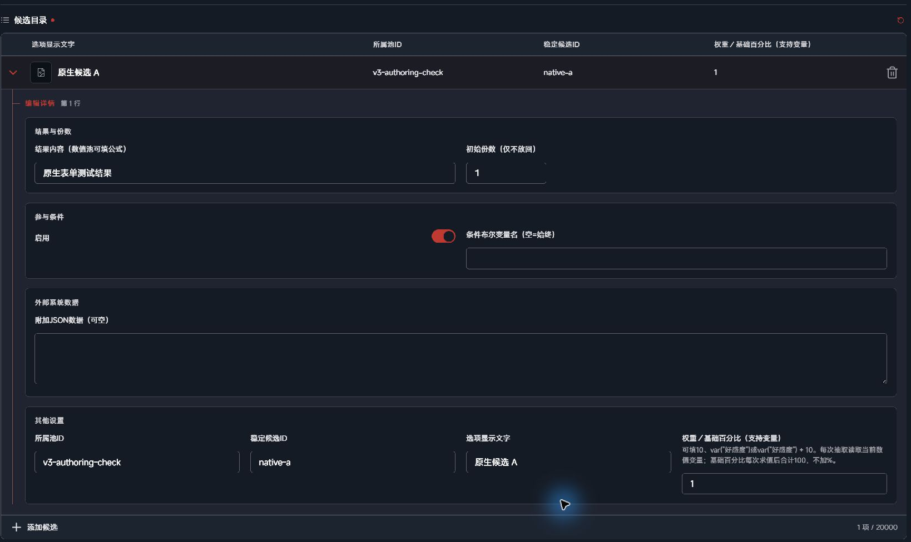
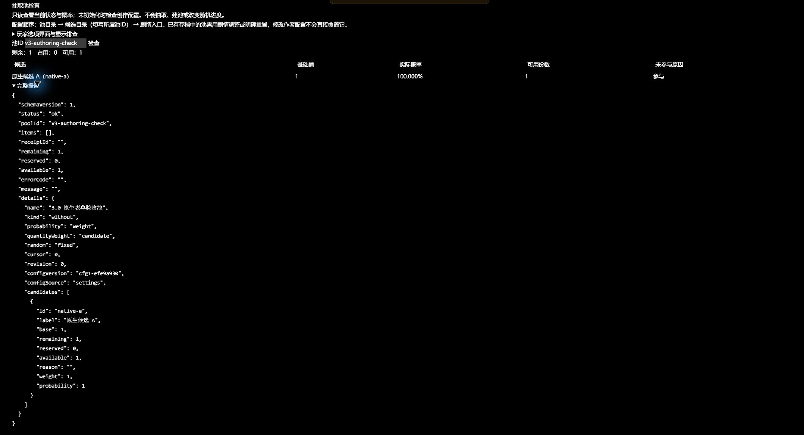
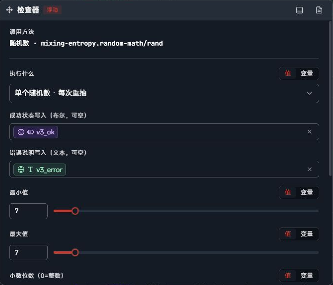
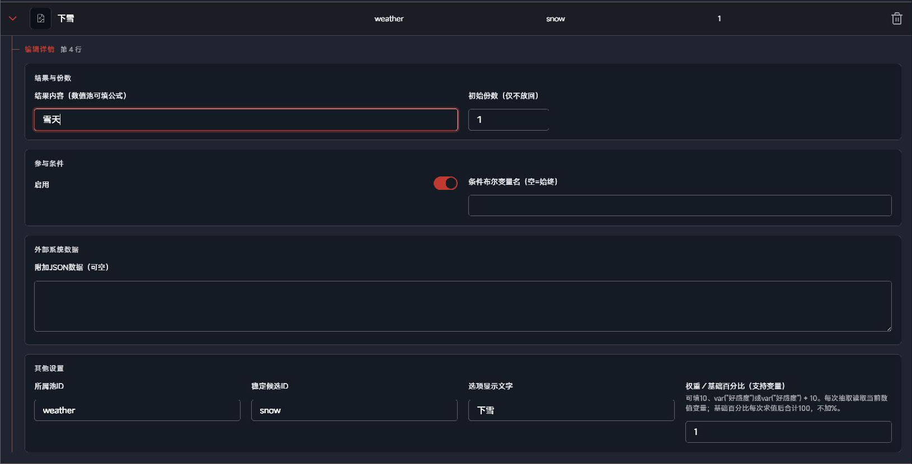
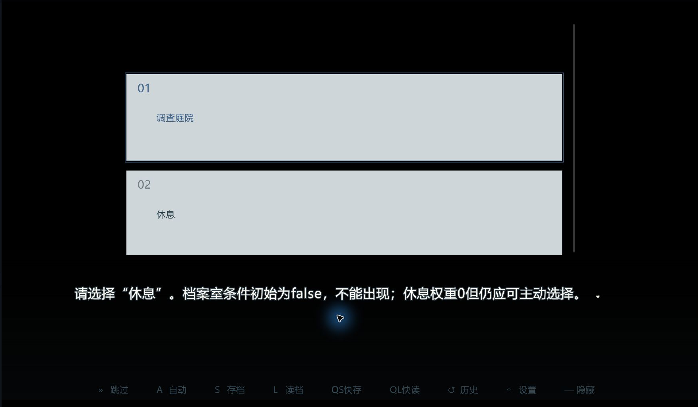
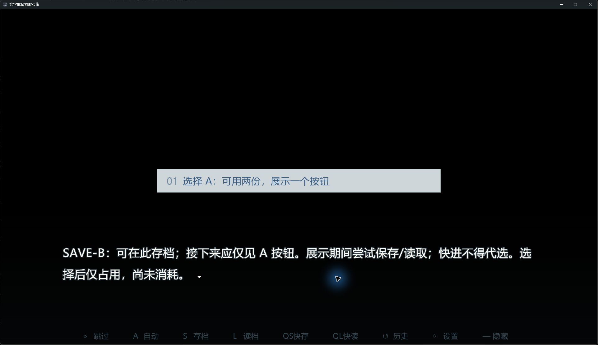
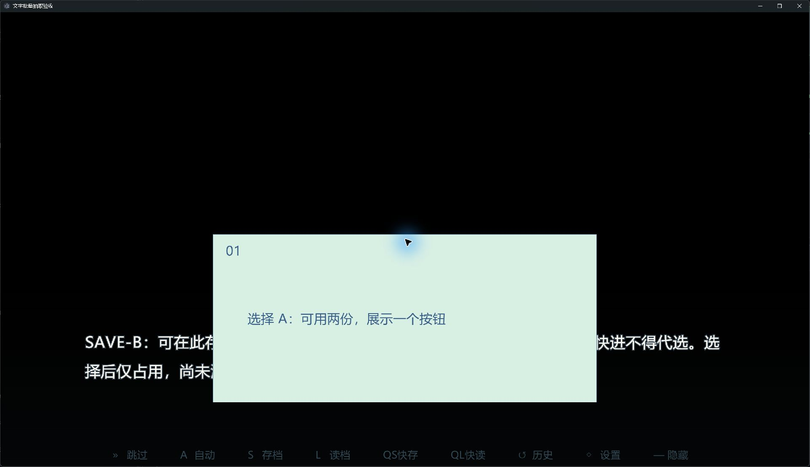
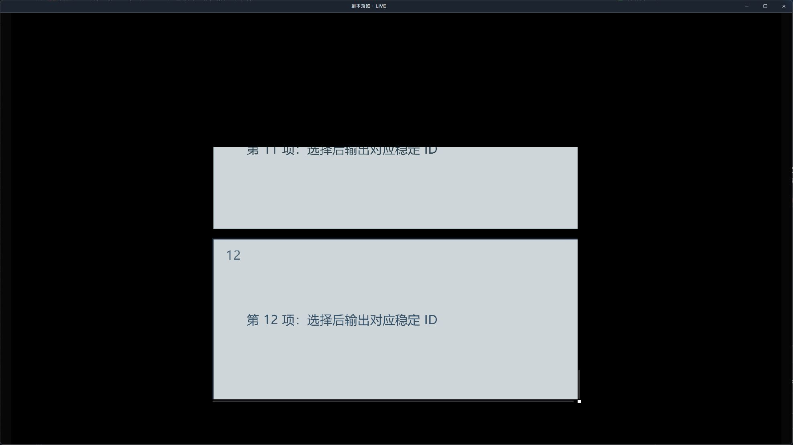
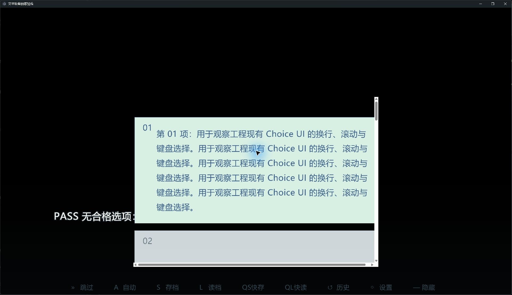

# 抽选与数学增强 · 创作者使用手册

插件：**3.0.0**。手册修订：2026-10-03（sdk.1）。

本手册介绍如何在剧本中使用随机数、抽取池、玩家选项与计算。第一次使用可从第2章准备变量，再按完整案例编排；AI Skill 的安装和使用见随包《AI Skill 安装与使用说明》。

## 1. 六个入口与基本概念

|入口|用来做什么|是否会改变游玩状态|
|---|---|---|
|随机数|生成范围内的整数、小数、批量结果；清除固定记录|抽取或清除时会|
|放回抽取|从指定放回池抽一个或一批结果|推进随机进度，候选不减少|
|不放回抽取|抽取、仅本次批量、确认消耗、取消占用|改变份数或凭证|
|调整抽取池|初始化、增加删除、权重概率份数调整、条件内容、批量、读取、重置删除|除读取外会|
|玩家选项|展示合格候选并等待玩家选择|选择后按池规则消耗|
|计算|算术、安全表达式、自定义表函数|写结果变量|

池是一个稳定ID标识的候选集合。显示名称可以改，剧本引用的ID保持不变；候选ID只要求在所属池内唯一。同一段文字可以对应不同ID。**不放回减少的是份数**，不是自动禁止相同文字再次出现。

“剩余”包含已占用；“可用”=剩余−占用。“凭证”记录延后消耗的一次抽取。配置属于作者，运行池属于当前存档；改变作者配置不会覆盖已开始的池。

检查配置和概率使用扩展的只读检查面板。剧本里的“读取状态”用于把余量写到变量，游玩到这里时才执行。初次学习按第2、4、5章操作；需要延后消耗和选择反馈看第7、8章。

## 2. 安装、启用与准备变量

1. 获取完整插件ZIP。已有作品先复制整个工程和升级前存档，保存旧插件包。
2. 在Studio扩展管理中按当前宿主支持的导入方式添加插件包，并在**目标工程**启用“抽选与数学增强”；核对ID `mixing-entropy.random-math` 和实际版本 `3.0.0`。下载文件不等于工程已经启用。
3. 打开扩展设置，在池目录填写池，再在候选目录填写所属池ID与候选ID。已有旧方法仍执行，默认不出现在新建列表；需要查看时可打开“显示旧版入口”。
4. 在工程变量面板提前声明输出变量。文本结果用文本变量，数字结果用数值变量；JSON数组、候选ID、凭证、报告和错误都用文本；成功用布尔。不能把结果和状态写进同一个变量。
5. 在剧本中添加扩展方法卡片，选六入口之一，然后选择操作并填写当前显示字段。需要后续分支判断时，打开高级执行反馈，绑定结果状态；执行后先判断状态，再使用结果或跳转剧情。四项反馈都可不填，但不填写时应自行安排抽空、失败或取消的处理流程。

四项可选执行反馈（完整报告、结果状态、成功状态、错误说明）统一放在“高级设置：执行反馈”下，默认收起。需要填写时打开开关；只控制界面显示，不启用或停用反馈功能。收起后已绑定变量仍会写入；要停止某项输出，请展开并清空该变量绑定。旧调用不需要新增此开关，也会继续按原绑定执行。单项结果、候选ID、结果数组和占用凭证保持在基本参数区。

建议公用变量：`result`文本、`candidate`文本、`values`文本、`receipt`文本、`status`文本、`ok`布尔、`error`文本、`left`数值、`report`文本。数字池另设`amount`数值。名称可自定，但卡片必须完全一致。

抽空或没有合格选项时，状态是`empty`，成功为假，错误说明会给出原因。抽取失败会保留之前的单项结果和数组，也不消耗池；因此后续分支必须先判断成功或状态，不能直接把旧结果当成本次抽中。旧工程迁移后仍保留“抽空有错误说明”的判断方式。

AI资料通过随包 `scripts/install-skill.py` 默认预览，确认路径后加`--apply`安装。有主Skill时进入实际用户的 `.letsgal-authoring/plugins/mixing-entropy.random-math/3.0.0/` 并补索引；没有主Skill才独立安装。给人看的步骤见随包《AI Skill 安装与使用说明》（docs/ai-install.html）；给AI读取的入口是skills/letsgal-plugin-random-math/SKILL.md。更多安装细节见AI-INTEGRATION，不把插件资料写入公共主Skill包。安装AI资料不会启用游戏插件。

### 界面截图与适用版本

以下为真实Studio **2.2.0-beta.1** 历史截图，仅用于识别变量面板及旧入口，不代表3.0新界面。以下另补2.4.0-beta.2中的目录、检查面板和rc.5简洁操作局部；第8章提供项目Choice编排实拍。每张图均按实际插件版本标注。


如果文字候选用鼠标选择后没有回填，使用方向键＋Enter或完整手填，再检查保存值。




报告里的基础值、实际概率、可用份数和未参与原因应一起核对。上图为rc.4界面，rc.5沿用这些字段。

## 3. 随机数：自定义面数与批量掷骰

骰子面数由范围决定。最小值填1、最大值填面数N、小数位填0、两端均包含，就会等概率生成1～N。六面骰只是例子；四面、八面、十面、十二面、二十面、一百面等都可以设置，也可使用其他有效整数范围。

|想生成什么|最小值|最大值|小数位|
|---|---|---|---|
|六面骰|1|6|0|
|二十面骰|1|20|0|
|一百面骰|1|100|0|
|0～99的随机整数|0|99|0|

下面以六面骰示范。建立`dice`数值、`ok`布尔和`error`文本。在随机数入口选“单个随机数 · 每次重抽”，最小1、最大6、小数位0、两端均包含、结果变量dice、成功ok、错误error。这个操作不需要填写数量、批量前缀或固定记录。接一个条件分支：先判断ok，再判断dice是否大于等于4；成功进入通过剧情，否则失败。生成的是1～6，不是0～6。



批量三个骰子：沿用上面的范围设置，再选“批量随机数 · 每次重抽”，数量3，数组结果填文本变量values。可选逐项前缀`dice`，事先建立`dice_1`、`dice_2`、`dice_3`数值变量；数组输出即可时不必填前缀。批量操作不显示单项结果变量。小数位支持0～6；包含端点决定离散网格范围，不能填无可用值的范围。

需要保存首次结果时，选择对应的“首次抽取后固定”操作，才显示固定记录及旧存档接入字段。为了保留旧剧本含义，默认仍为“完整参数（兼容既有调用）”，其原有模式、数量、变量绑定不变；新编排可直接选择上述简洁操作。切换到简洁操作后，只使用该操作专属的输入，不继承完整参数中隐藏的值；请核对范围和输出。操作切换不会自动清除已保存的固定记录。

范围随机的“首次抽取后固定”保留旧规则：首次结果跟随存档记录，复用同名固定记录时范围和数量必须一致。记录名为空时单次用`value:变量名`，批量用`batch:前缀`。清除记录选择同入口的“清除指定固定记录”，填确切记录名；结果变量不会自动清空。

## 4. 完整案例：放回抽取天气

目标：每个游戏日抽天气，晴天可以连续出现。

在池目录新增：ID `weather`，名称天气，类型放回，结果文字，概率相对权重，随机策略允许读档重抽。候选目录添加：

|所属池ID|候选ID|显示文字|结果内容|权重|启用|
|---|---|---|---|---|---|
|weather|sun|晴朗|晴天|6|是|
|weather|rain|下雨|雨天|3|是|
|weather|snow|下雪|雪天|1|是|

每天剧情放一张“放回抽取”卡，并打开高级执行反馈以填写状态等变量：目标池weather，数量1，单项result，候选ID candidate，状态status，成功ok，错误error。第一次自动初始化，不需要额外建池卡。判断status=ok后，以candidate=sun/rain/snow连接天气剧情。再次执行仍是60%/30%/10%，没有份数消耗。放回池完整报告中的remaining/available为null。




若要一次产生三天天气，数量3、结果数组values，得到如`["晴天","雨天","晴天"]`。这是可能的结果示意，不是保证序列。结果数组包含文字，ID数组要另设文本输出。

## 5. 完整案例：不放回、份数和两种计权

目标：奖袋里A有10份、B有1份。池ID `bag`，类型不放回，文字结果，相对权重，同一进度固定。添加A：ID a、显示A、值A、权重1、初始份数10；B：ID b、显示B、值B、权重1、份数1；条件均空，启用。

在“不放回抽取”选“从池中抽取”，打开高级执行反馈，池bag，数量1，立即消耗，结果result、ID candidate、剩余left、状态status。先检查status；ok时进入领奖剧情。每执行一次减少一份，抽中A后仍可能抽中A，直到它的十份用完。余量不足时整批失败，不部分给奖；耗尽后保持耗尽，不自动补满。

|池的份数计权方式|第一次A概率|第一次B概率|适合含义|
|---|---|---|---|
|按候选计权（默认）|50%|50%|两类事件同等机会，份数只限制次数|
|按每份计权|10/11|1/11|每张签都有同样机会|

按每份计权时每次抽后重新计算，所以A抽掉一份后其权重是9，B仍为1。复制池为`bag-unit`可比较两种规则；不要直接改作者配置期待已有bag自动切换。

“仅本次批量不放回”使用JSON数组，例如`["A","B","C"]`，数量2；每次调用都是独立临时集合，不存成跨剧情池。相同文字不同数组位置默认不同候选。

## 6. 权重、基础百分比与简单条件

新池二选一：相对权重填数字或安全表达式；基础百分比填0～100的数值或表达式，**不加百分号**，所有候选基础值合计100。旧表的`10%`与数字混合是旧兼容语义，不能照搬成新池。

基础20/30/50，第三项条件不满足时，实际参与概率为40%/60%。启停、条件、份数会影响本次概率；按每份计权还会乘可用份数。不会凭空增加“未中奖”，需要时添加一个明确的空签候选。

每个候选的条件只填写一个布尔变量名，例如`can_visit`。为空表示始终；变量为false则不参与；缺失或不是布尔值会报错。复杂的“AB完成且C>10”由前面的剧情条件或外部系统计算为can_visit，再供池读取。池系统不认识世界事件或角色关系。

**权重可以直接引用数值变量。** 在“权重／基础百分比”栏填 `var("好感度")`，或填 `var("好感度") + 10`；先在工程中声明“好感度”为数值变量。这里保留普通文本输入并写上述表达式，不把变量名当作一个数字。放回和不放回池都支持，已经初始化的池也会在每次抽取时读取变量当前值，无需重建池。

例如A的权重填 `var("好感度")`，B填 `10`：好感度为10时各50%，剧情把好感度改为30后，下次A为75%、B为25%（按候选计权，且两项均可参与）。一个批量使用同一份变量快照；下一个抽取动作才读取新的变量值。变量缺失、类型不是数值或权重为负会明确报错，不静默改为零。全部有效权重为零时没有可抽取候选。

“调整抽取池→设置权重”填 `var("好感度")` 会保留表达式，以后持续跟随变量；“增减权重”填 `var("奖励加成")` 则只在执行这次调整时求值，将计算结果作为新的固定权重。需要持续“好感度加10”，使用“设置权重”填 `var("好感度") + 10`。基础百分比也支持变量表达式，但每次求值后基础合计必须为100；“设置基础百分比”按当次值分配其他候选，结果保存为固定数值。

新增池不接受旧表自定义函数名；需要表函数时先用“计算”输出变量再引用。

调整基础百分比：原20/30/50，将A设置40，B/C按原30:50分配剩余60，得到40/22.5/37.5。批量同时指定A40、B40，C得到20。超100、负数、全部为零或没有可分配对象都会失败。检查面板显示基础设置、本次概率及排除原因；只读不会建池或推进随机。

## 7. 完整案例：先占用、完成后消耗

沿用bag，准备receipt文本变量。以下数量以重置后、尚未抽取的11份为起点；若接着第5章已经抽取的池，请先确认没有占用，再明确重置。在“不放回抽取→从池中抽取”选择“先占用，完成后确认”，数量1、凭证输出receipt，其余同第5章。status=ok时保存本次candidate/result并进入事件。假设抽中A：剩余仍11，占用1，可用10；别人不能抽走这份占用。

事件完成：新增“不放回抽取→确认消耗”，凭证输入绑定receipt变量的**值**；成功后剩余10、占用0。事件放弃：选“取消占用”，同样绑定receipt的值；释放后剩余11、占用0。不要把变量名当成凭证字符串，若填写的是文本字段需切换变量绑定。

同一凭证重复确认或重复取消不再次扣除；已确认再取消会报错。保存与读取保留凭证状态。取消不倒退随机进度，下一抽可以改变。存在占用时不能重置／删除该池，不能删掉已占用候选或把其剩余份数减到占用以下。

## 8. 完整案例：玩家选择后调整目标池

目标：玩家在三个事件中选一个，完成事件后提高另一个奖池对应候选的权重。

配置放回池`events`，文字结果。候选：a/调查庭院/yard/权重1，b/访问档案室/archive/权重1/条件`archive_open`，c/休息/rest/权重0。先建archive_open布尔变量，初值false；允许访问档案室的剧情节点将它设置为true。c权重为零不会随机抽中，但主动玩家选项仍显示它。

放一张“玩家选项”，打开高级执行反馈：目标池events，请求名`day1-events`，单项result，候选ID candidate，状态status。符合条件的候选各显示一次；条件为false的档案室不显示。插件通过项目现有Choice界面展示，保留项目绑定。快进不会代选。无候选输出empty，绝不把被排除的选项重新放出来。

status=ok后按candidate分支。先在池目录建立放回池`reward`：文字结果、相对权重、每次重抽；在候选目录添加a/A/A、b/B/B、c/C/C，权重均1、启用且条件为空。声明`event_completed`布尔变量，初值false；事件成功结束时由剧情赋值为true。两个池使用相同候选ID进行对应，在事件结束处添加“调整抽取池→增减权重”：目标池reward，目标候选ID绑定candidate变量的值，数值填`2`，可选执行条件填`event_completed`布尔变量。条件false跳过且不建池，此时布尔成功变量为true，状态为skipped；true把该候选权重加2，状态为ok。这是创作者定义的反馈，不是插件自动监听片段完成。



本图是上述案例的真实运行：档案室条件为false，因此未显示；休息权重为零，仍可主动选择。



上图为rc.1历史界面，展示同一候选有两份时仍只出现一个按钮。图片的来源与适用版本见images/PROVENANCE.md。



rc.4历史图展示了条件筛选后的选项。当前版本的展示中存读档规则见本章、第9章及随包验证说明。

需要同时改权重、启用及份数时，在批量调整目录添加同一组ID的多行，按行顺序生效；操作“执行一组批量调整”填组ID和一个目标池。候选ID变量填写candidate；数值可用`var("bonus")`。任一行失败，全组不提交。跨池用独立卡片，不宣称跨池事务。

对不放回池展示玩家选项时，可选立即消耗或延后占用，凭证流程同第7章。显示期间条件或份数改变会在选择时再核对，过期选择输出错误且不扣份数。关闭界面未选则skipped，运行取消保留待选状态供恢复；已完成回放不重复扣除。自定义界面后应检查取消、过期选择和读档后的表现。适用范围见 VALIDATION-3.0.md。

### 自己编排玩家选项 UI

在 Studio 2.4.0-beta.2 中，可以通过“个性化→选项→在UI编辑器中编辑”修改工程正在绑定的选项界面。先备份项目界面，再调整选项列表、按钮框体、正文、序号和装饰的布局。保留组件ID、列表类型、文字绑定和点击回调。保存后本项目界面显示“已自定义”，官方branch和本插件玩家选项共用这份外观。候选、条件、权重和份数仍由池配置及剧本方法决定。




这两张历史示例把按钮高度改为400、正文398、列表640，以容纳这段长文；短选项也会变高，所以不要直接把这些尺寸当成所有作品的最佳布局。这份历史示例不自动适配任意长度，也需要另查对话框遮挡及自己的分辨率。



上述 rc.4 历史导出中长文完整、末项可用End到达并选择。仍可见列表横向滚动条和对话叠加，需在项目界面中继续优化；插件不会替换工程皮肤。该图为原始窗口截图，版本及校验值见来源说明。

本版在 Studio 2.4.0-beta.2 的合成工程继续整理了这份界面：选项列表 1240×640，位置 X=340、Y=40；按钮 1200×240；正文 1080×238，字号 25、行高 1.5。长文四行完整，选项区与对白分开，无横向滚动条，滚轮及 End／Enter 可选择第12项。该组数值只适用这份 1920×1080 画布，其他分辨率和文案应重新排版；不会自动写入你的工程。


### 多选项或长文字显示不完整

检查面板显示宿主返回的Choice绑定。列表顶部无法滚到、或文字超过按钮高度时，按随包 [选项界面兼容说明](CHOICE-UI-COMPATIBILITY.md)检查项目副本；保留原绑定和外观，不改引擎安装文件。列表滚动与单条文字高度需要分别处理。

备份并确认正在使用的项目界面后，可在其“选项列表”组件自定义CSS末尾追加以下在合成工程实测的规则，保留已有内容。它让超高列表从首项开始，支持安全居中的环境在放得下时仍居中：

```css
& [role="menu"][aria-label="剧情选项"] {
  justify-content: flex-start !important;
  justify-content: safe center !important;
}
```

规则只处理列表的排列起点。单条长文字裁切还需分别调整按钮框体和正文高度；自定义React界面要核对自身结构，不能直接套用选择器。至少核对少量选项、12项滚动、首末项点击、键盘选择及存读档后选择。rc.2合成工程的长文、12项首尾、滚动及键盘通过；展示中读档恢复24份，重新选择后只减为23份。官方branch同UI对照通过。宿主默认界面、其他主题与新导出未由此自动通过。

## 9. 调整、存档与固定结果

初始化从当前配置建立，已存在时保留，包括已有占用凭证的情况；也可从JSON数组或旧候选表导入一个快照。旧表导入只读取当时有效结果与概率，不再动态追踪原表。添加候选不会回写作者表。重置从当前创作配置重新开始；数组临时导入若没有对应配置不能按配置重置，应明确删除后重新导入。

|剧情操作|主要输入|结果或限制|
|---|---|---|
|新增|稳定候选ID、显示、结果、权重或基础百分比、份数、条件、附加JSON|ID重复失败；百分比池按规则分配其他占比|
|移除／启停|候选ID|占用候选不能移除；停用不释放占用|
|设置／增减权重|候选ID、数值／表达式|仅相对权重池；不允许负权重|
|设置基础百分比|候选ID、0～100|仅百分比池，其余比例分配|
|设置／增减剩余份数|候选ID、整数|仅不放回；不低于占用|
|修改条件／内容|候选ID、新条件或显示与结果|后续抽取使用新值|
|读取|池ID、余量变量或完整报告|不建池、不抽取|
|重置／删除|池ID|有未处理占用拒绝；删除后需明确初始化|

“允许读档重抽”每次实际抽取取新随机值，不保证必然不同。“同一进度固定”把池的种子和进度随当前槽保存，在同一池状态、条件与操作下读档结果相同。改变候选、权重、条件或操作数量可以改变结果。**读回建池前不保证固定**；不同存档不共同消耗。

作者配置变动不会覆盖已有池。需要新配置生效时在剧情明确重置；旧作品若继续原池，不要每次抽前重置。程序不直接编辑存档文件。升级后的新存档不承诺供旧插件降级读取，回退使用升级前备份。

“允许读档重抽”意味着使用新的随机值，仍可能抽到相同结果；不能用一次结果相同判定失效。“同一进度固定”仅保障建池后的同状态、条件和操作；读回建池前或调整候选／条件后不保证相同。“随机数”的首次记录固定沿用旧规则，不等同于池的随机进度固定。

池报告的`configVersion`记录建池定义的内容指纹，`configSource`记录配置／数组／旧表／旧池来源；`revision`记录运行修改次数。指纹只用于追溯，不用于安全校验、自动迁移或覆盖存档。早期3.0存档没有这些字段时显示UNKNOWN，不能推造当年的配置版本。

## 10. 计算、表达式与结果报告

计算入口保留加减乘除、幂、开方、向下取整、四舍五入、表达式和函数规则表。示例：在函数规则表新增名称damage_rule、表达式`clamp(round(x*y),0,100)`；计算选自定义函数并填damage_rule，x绑定攻击、y绑定倍率，结果写数值变量damage，成功后再使用。表函数仍通过函数规则表定义名称和表达式，禁止递归。新增池的数值输入支持现有基础安全表达式；表函数先在计算入口求值再传入变量。

允许数字、x/y/z/w、`+ - * / ^`、比较与三元条件，内置sqrt/pow/floor/round/min/max/clamp，以及`var("变量名")`。不执行任意脚本，不访问文件或网络。除零、非有限结果、未知变量或递归等会报错。

### 直接填写公式

在工程中声明“攻击”为数值变量，初值20；另建数值变量damage、布尔变量ok、文本变量error。在“计算”选择“直接公式”，公式填 `var("攻击") * 0.8 + 10`，结果变量绑定damage，成功状态绑定ok，错误说明绑定error。成功时damage为26；把攻击改为30后再执行，结果为34。后续先判断ok，再使用damage。无需建立函数规则表。

新增操作的数值栏均可填常量或变量公式，例如 `var("体力") + 5`。变量须预先声明且是数值类型；文本“20”不等于数值20。保留小数位数也可引用变量，求值后必须为0～6整数。数值输出不保留显示尾零，1.50写入数值变量后是1.5。


图：合成示例工程中的“直接公式”参数表单。示例变量power为数值类型，公式为`var("power") * 0.8 + 10`；结果、成功状态与错误说明分别绑定对应类型的变量。截图保留完整Studio窗口，可点击放大查看。

### 常用计算怎么选

|操作|输入示例|结果与用途|
|---|---|---|
|向上取整|2.1；-2.1|3；-2|
|去掉小数（向零取整）|2.9；-2.9|2；-2|
|四舍五入到指定小数位|1.005；小数位2|1.01；-1.005得到-1.01，半值向远离零方向取整|
|绝对值|-7|7，例如比较差值大小|
|求余数|-7；除数4|-3，保留被除数符号|
|循环取模|-7；正模数4|1，适合从0开始的循环位置|
|取较小值／取较大值|10；30|10／30|
|限制在指定范围|150；下限0；上限100|100，例如限制体力上限|

若编号从1开始、共有4项，用直接公式 `mod(var("编号") - 1, 4) + 1` 循环到1～4。循环取模要求模数大于0；余数要求除数不为0。范围下限不能大于上限。指定小数位按输入数值的十进制表示舍入，数值过大、无法安全保留所需位数时会报错。

直接公式支持数字、`+ - * / ^`、比较与三元条件、`var("变量名")`，以及 `sqrt/pow/floor/round/min/max/clamp/ceil/trunc/abs/roundDigits/remainder/mod`。例如 `clamp(roundDigits(var("攻击") * 1.25, 2), 0, 100)`。这里用var读取工程变量，不能直接写x/y/z/w，也不调用函数规则表里的名称。

原“自定义函数”继续使用函数规则表及x/y/z/w参数；已有运算和表函数含义保持。原“round／四舍五入”仍沿用旧规则：-1.5得到-1；新增“指定小数位”保留0位则得到-2。新增函数只用于新的计算输入；抽取池公式仍沿用原函数集合，需要新增数学函数时先计算到数值变量，再在池中引用该变量。

除零、变量缺失、类型错误、非法精度或非有限结果会失败，旧结果变量保留，成功状态为false并给出错误说明。计算方法失败返回-1，但-1也可能是合法计算结果，所以不能只用返回值等于-1判断失败。

新抽取／调整／选项统一报告为JSON文本：schemaVersion=1；status为ok/skipped/empty/error；poolId；items含id/label/value/quantity和可选data；receiptId；remaining/reserved/available；errorCode/message。检查报告另有details候选概率。附加JSON数据只透传，不执行；未来外部世界状态可消费稳定ID和报告，不要求把复杂规则塞进本插件。

布尔成功变量（本手册命名为ok）在操作成功或按条件跳过时都为true。文本状态变量status分别为ok或skipped；抽取或玩家选择后，先检查status=ok再使用本次结果。需要从完整报告判断时，再检查items非空；items是报告里的数组，不是需要另建的工程变量。初始化、读取和调整成功时也可能是ok且没有items，不能按“没有抽中结果”判定这些操作失败。失败时单项旧值可能保留，禁止只检查result非空。单项变量仅数量1写入，批量用数组JSON；数组不是可直接调用的剧本片段。

## 11. 全功能参数速查

以下参数表由本候选实际方法定义生成。普通创作者使用中文标签；字段名供迁移和AI核对。带`操作__`前缀的是该操作专属字段。参数绑定必须使用当前宿主实际格式，表中的参数意图不能直接当章节节点导入。

<!-- PARAMETERS-BEGIN -->
### 随机数：rand

选择单个／批量及重抽／固定；完整参数保留既有调用。也可清除指定固定记录。

返回：number，单次结果／批量数量；清除成功1、失败-1。

|字段|填写含义|类型|默认|选项|显示条件|
|---|---|---|---|---|---|
|action|执行什么|enum|"generate"|single-fresh：单个随机数 · 每次重抽；batch-fresh：批量随机数 · 每次重抽；single-fixed：单个随机数 · 首次抽取后固定；batch-fixed：批量随机数 · 首次抽取后固定；generate：完整参数（兼容既有调用）；reset：清除指定固定记录|始终|
|mode|模式|enum，必填|"fresh"|fresh：每次重抽；sticky：首次抽取后固定（随存档）|action = "generate"|
|min|最小值|number，必填|0||action = "generate"|
|max|最大值|number，必填|100||action = "generate"|
|digits|小数位数（0=整数）|number|0||action = "generate"|
|includeMin|包含最小端点|boolean|true||action = "generate"|
|includeMax|包含最大端点|boolean|true||action = "generate"|
|count|数量（大于1批量输出）|number|1||action = "generate"|
|outVar|单次结果变量|variable|—||action = "generate"|
|prefix|批量前缀（数量大于1时使用）|string|""||action = "generate"|
|reportVar|完整结果数组（JSON文本，可空）|variable|—||action = "generate"|
|fixedKey|固定记录名（空=结果变量或批量前缀）|string|""||action = "generate"|
|fixedPolicy|旧存档首次接入|enum|"fresh"|fresh：首次生成，忽略输出默认值；adopt：采用完整的既有结果|action = "generate"|
|successVar|成功状态写入（布尔，可空）|variable|—||始终|
|errorVar|错误说明写入（文本，可空）|variable|—||始终|
|single-fresh__min|最小值|number，必填|0||action = "single-fresh"|
|single-fresh__max|最大值|number，必填|100||action = "single-fresh"|
|single-fresh__digits|小数位数（0=整数）|number|0||action = "single-fresh"|
|single-fresh__includeMin|包含最小端点|boolean|true||action = "single-fresh"|
|single-fresh__includeMax|包含最大端点|boolean|true||action = "single-fresh"|
|single-fresh__outVar|单次结果变量|variable|—||action = "single-fresh"|
|single-fresh__reportVar|完整结果数组（JSON文本，可空）|variable|—||action = "single-fresh"|
|batch-fresh__min|最小值|number，必填|0||action = "batch-fresh"|
|batch-fresh__max|最大值|number，必填|100||action = "batch-fresh"|
|batch-fresh__digits|小数位数（0=整数）|number|0||action = "batch-fresh"|
|batch-fresh__includeMin|包含最小端点|boolean|true||action = "batch-fresh"|
|batch-fresh__includeMax|包含最大端点|boolean|true||action = "batch-fresh"|
|batch-fresh__count|批量数量|number|2||action = "batch-fresh"|
|batch-fresh__prefix|批量前缀（数量大于1时使用）|string|""||action = "batch-fresh"|
|batch-fresh__reportVar|完整结果数组（JSON文本，可空）|variable|—||action = "batch-fresh"|
|single-fixed__min|最小值|number，必填|0||action = "single-fixed"|
|single-fixed__max|最大值|number，必填|100||action = "single-fixed"|
|single-fixed__digits|小数位数（0=整数）|number|0||action = "single-fixed"|
|single-fixed__includeMin|包含最小端点|boolean|true||action = "single-fixed"|
|single-fixed__includeMax|包含最大端点|boolean|true||action = "single-fixed"|
|single-fixed__outVar|单次结果变量|variable|—||action = "single-fixed"|
|single-fixed__reportVar|完整结果数组（JSON文本，可空）|variable|—||action = "single-fixed"|
|single-fixed__fixedKey|固定记录名（空=结果变量或批量前缀）|string|""||action = "single-fixed"|
|single-fixed__fixedPolicy|旧存档首次接入|enum|"fresh"|fresh：首次生成，忽略输出默认值；adopt：采用完整的既有结果|action = "single-fixed"|
|batch-fixed__min|最小值|number，必填|0||action = "batch-fixed"|
|batch-fixed__max|最大值|number，必填|100||action = "batch-fixed"|
|batch-fixed__digits|小数位数（0=整数）|number|0||action = "batch-fixed"|
|batch-fixed__includeMin|包含最小端点|boolean|true||action = "batch-fixed"|
|batch-fixed__includeMax|包含最大端点|boolean|true||action = "batch-fixed"|
|batch-fixed__count|批量数量|number|2||action = "batch-fixed"|
|batch-fixed__prefix|批量前缀（数量大于1时使用）|string|""||action = "batch-fixed"|
|batch-fixed__reportVar|完整结果数组（JSON文本，可空）|variable|—||action = "batch-fixed"|
|batch-fixed__fixedKey|固定记录名（空=结果变量或批量前缀）|string|""||action = "batch-fixed"|
|batch-fixed__fixedPolicy|旧存档首次接入|enum|"fresh"|fresh：首次生成，忽略输出默认值；adopt：采用完整的既有结果|action = "batch-fixed"|
|resetKey|要清除的固定记录名|string|""||action = "reset"|

### 放回抽取：draw-replace

从指定放回池抽取，候选不会因抽取而减少。

返回：剧情动作；通过变量输出，不作为If条件候选。

|字段|填写含义|类型|默认|选项|显示条件|
|---|---|---|---|---|---|
|poolId|目标池ID（见扩展设置的池目录）|string，必填|—||始终|
|count|抽取数量|number|1||始终|
|outVar|单项结果（与池结果类型一致，可空）|variable|—||始终|
|idVar|单项候选ID（文本，可空）|variable|—||始终|
|valuesVar|结果数组JSON（文本，可空）|variable|—||始终|
|idsVar|候选ID数组JSON（文本，可空）|variable|—||始终|
|prefix|逐项输出前缀（可空，预先声明 前缀_1…N）|string|""||始终|
|showAdvancedFeedback|高级设置：执行反馈（可选）|boolean|false||始终|
|reportVar|完整报告（文本，可空）|variable|—||showAdvancedFeedback = true|
|statusVar|结果状态 ok/skipped/empty/error（文本，可空）|variable|—||showAdvancedFeedback = true|
|successVar|成功状态（布尔，可空）|variable|—||showAdvancedFeedback = true|
|errorVar|错误说明（文本，可空）|variable|—||showAdvancedFeedback = true|

### 不放回抽取：draw-without

抽取并消耗或占用份数；也可确认消耗、取消占用。

返回：剧情动作；通过变量输出，不作为If条件候选。

|字段|填写含义|类型|默认|选项|显示条件|
|---|---|---|---|---|---|
|action|执行什么|enum|"draw"|draw：从池中抽取；batch：仅本次批量不放回（JSON数组）；confirm：确认消耗；cancel：取消占用|始终|
|draw__poolId|目标池ID（见扩展设置的池目录）|string，必填|—||action = "draw"|
|draw__count|抽取数量|number|1||action = "draw"|
|draw__outVar|单项结果（与池结果类型一致，可空）|variable|—||action = "draw"|
|draw__idVar|单项候选ID（文本，可空）|variable|—||action = "draw"|
|draw__valuesVar|结果数组JSON（文本，可空）|variable|—||action = "draw"|
|draw__idsVar|候选ID数组JSON（文本，可空）|variable|—||action = "draw"|
|draw__prefix|逐项输出前缀（可空，预先声明 前缀_1…N）|string|""||action = "draw"|
|draw__receiptVar|占用凭证（文本，延后消耗时填写）|variable|—||action = "draw"|
|draw__remainingVar|剩余份数（数值，可空）|variable|—||action = "draw"|
|draw__availableVar|可用份数（数值，可空）|variable|—||action = "draw"|
|draw__consumption|消耗时机|enum|"immediate"|immediate：立即消耗；deferred：先占用，完成后确认|action = "draw"|
|batch__poolId|本次操作名称|string，必填|—||action = "batch"|
|batch__arrayJson|JSON数组|string|"[]"||action = "batch"|
|batch__valueType|结果类型|enum|"text"|text：文字；number：数值或公式|action = "batch"|
|batch__count|抽取数量|number|1||action = "batch"|
|batch__outVar|单项结果（与池结果类型一致，可空）|variable|—||action = "batch"|
|batch__idVar|单项候选ID（文本，可空）|variable|—||action = "batch"|
|batch__valuesVar|结果数组JSON（文本，可空）|variable|—||action = "batch"|
|batch__idsVar|候选ID数组JSON（文本，可空）|variable|—||action = "batch"|
|batch__prefix|逐项输出前缀（可空，预先声明 前缀_1…N）|string|""||action = "batch"|
|batch__remainingVar|剩余份数（数值，可空）|variable|—||action = "batch"|
|batch__availableVar|可用份数（数值，可空）|variable|—||action = "batch"|
|confirm__receiptId|抽取凭证|string|""||action = "confirm"|
|confirm__outVar|单项结果（与池结果类型一致，可空）|variable|—||action = "confirm"|
|confirm__idVar|单项候选ID（文本，可空）|variable|—||action = "confirm"|
|confirm__valuesVar|结果数组JSON（文本，可空）|variable|—||action = "confirm"|
|confirm__idsVar|候选ID数组JSON（文本，可空）|variable|—||action = "confirm"|
|confirm__prefix|逐项输出前缀（可空，预先声明 前缀_1…N）|string|""||action = "confirm"|
|confirm__receiptVar|占用凭证（文本，延后消耗时填写）|variable|—||action = "confirm"|
|confirm__remainingVar|剩余份数（数值，可空）|variable|—||action = "confirm"|
|confirm__availableVar|可用份数（数值，可空）|variable|—||action = "confirm"|
|cancel__receiptId|抽取凭证|string|""||action = "cancel"|
|cancel__outVar|单项结果（与池结果类型一致，可空）|variable|—||action = "cancel"|
|cancel__idVar|单项候选ID（文本，可空）|variable|—||action = "cancel"|
|cancel__valuesVar|结果数组JSON（文本，可空）|variable|—||action = "cancel"|
|cancel__idsVar|候选ID数组JSON（文本，可空）|variable|—||action = "cancel"|
|cancel__prefix|逐项输出前缀（可空，预先声明 前缀_1…N）|string|""||action = "cancel"|
|cancel__receiptVar|占用凭证（文本，延后消耗时填写）|variable|—||action = "cancel"|
|cancel__remainingVar|剩余份数（数值，可空）|variable|—||action = "cancel"|
|cancel__availableVar|可用份数（数值，可空）|variable|—||action = "cancel"|
|showAdvancedFeedback|高级设置：执行反馈（可选）|boolean|false||始终|
|reportVar|完整报告（文本，可空）|variable|—||showAdvancedFeedback = true|
|statusVar|结果状态 ok/skipped/empty/error（文本，可空）|variable|—||showAdvancedFeedback = true|
|successVar|成功状态（布尔，可空）|variable|—||showAdvancedFeedback = true|
|errorVar|错误说明（文本，可空）|variable|—||showAdvancedFeedback = true|

### 调整抽取池：pool-update

剧情运行时调整指定池，或读取状态。批量调整全部成功后才提交。

返回：剧情动作；通过变量输出，不作为If条件候选。

|字段|填写含义|类型|默认|选项|显示条件|
|---|---|---|---|---|---|
|action|执行什么|enum|"inspect"|initialize：从配置初始化池（已存在时保留）；import-array：从JSON数组初始化（已存在时保留）；import-table：从旧候选表初始化快照（已存在时保留）；reset：重置为当前创作配置；delete：删除池；add：新增候选；remove：移除候选；enable：启用候选；disable：停用候选；set-rate：设置权重；add-rate：增减权重；set-percent：设置基础百分比（其他候选按比例分配）；set-quantity：设置剩余份数；add-quantity：增减剩余份数；set-condition：修改参与条件；set-content：修改显示和结果内容；batch-adjust：执行一组批量调整；inspect：读取状态和概率报告|始终|
|poolId|目标池ID（见扩展设置的池目录）|string，必填|—||始终|
|when|仅当此布尔变量为真时执行（可空）|variable|—||始终|
|import-array__arrayJson|JSON数组|string|"[]"||action = "import-array"|
|import-array__kind|导入池类型|enum|"without"|with：放回；without：不放回|action = "import-array"|
|import-array__valueType|导入结果类型|enum|"text"|text：文字；number：数值或公式|action = "import-array"|
|import-array__random|导入随机策略|enum|"fixed"|fixed：同一进度固定；fresh：允许读档重抽|action = "import-array"|
|import-table__tablePool|旧表池名|string|""||action = "import-table"|
|import-table__field|结果列|string|"label"||action = "import-table"|
|import-table__kind|导入池类型|enum|"without"|with：放回；without：不放回|action = "import-table"|
|import-table__valueType|导入结果类型|enum|"text"|text：文字；number：数值或公式|action = "import-table"|
|import-table__random|导入随机策略|enum|"fixed"|fixed：同一进度固定；fresh：允许读档重抽|action = "import-table"|
|add__candidateId|目标候选ID|string|""||action = "add"|
|add__label|显示文字|string|""||action = "add"|
|add__value|结果内容（数值池可填公式）|string|""||action = "add"|
|add__rate|权重／基础百分比（可填 var("好感度")）|string|"1"||action = "add"|
|add__quantity|初始份数（不放回池）|number|1||action = "add"|
|add__condition|参与条件的布尔变量名（空=始终）|string|""||action = "add"|
|add__data|附加JSON数据（可空）|string|""||action = "add"|
|remove__candidateId|目标候选ID|string|""||action = "remove"|
|enable__candidateId|目标候选ID|string|""||action = "enable"|
|disable__candidateId|目标候选ID|string|""||action = "disable"|
|set-rate__candidateId|目标候选ID|string|""||action = "set-rate"|
|set-rate__amount|数值／变量表达式（如 var("好感度")）|string|"0"||action = "set-rate"|
|add-rate__candidateId|目标候选ID|string|""||action = "add-rate"|
|add-rate__amount|数值／变量表达式（如 var("好感度")）|string|"0"||action = "add-rate"|
|set-percent__candidateId|目标候选ID|string|""||action = "set-percent"|
|set-percent__amount|数值／变量表达式（如 var("好感度")）|string|"0"||action = "set-percent"|
|set-quantity__candidateId|目标候选ID|string|""||action = "set-quantity"|
|set-quantity__amount|数值／变量表达式（如 var("好感度")）|string|"0"||action = "set-quantity"|
|add-quantity__candidateId|目标候选ID|string|""||action = "add-quantity"|
|add-quantity__amount|数值／变量表达式（如 var("好感度")）|string|"0"||action = "add-quantity"|
|set-condition__candidateId|目标候选ID|string|""||action = "set-condition"|
|set-condition__condition|布尔变量名（空=始终）|string|""||action = "set-condition"|
|set-content__candidateId|目标候选ID|string|""||action = "set-content"|
|set-content__label|显示文字|string|""||action = "set-content"|
|set-content__value|结果内容|string|""||action = "set-content"|
|batch-adjust__batchId|批量调整组ID|string|""||action = "batch-adjust"|
|inspect__remainingVar|剩余份数（数值，可空）|variable|—||action = "inspect"|
|inspect__availableVar|可用份数（数值，可空）|variable|—||action = "inspect"|
|showAdvancedFeedback|高级设置：执行反馈（可选）|boolean|false||始终|
|reportVar|完整报告（文本，可空）|variable|—||showAdvancedFeedback = true|
|statusVar|结果状态 ok/skipped/empty/error（文本，可空）|variable|—||showAdvancedFeedback = true|
|successVar|成功状态（布尔，可空）|variable|—||showAdvancedFeedback = true|
|errorVar|错误说明（文本，可空）|variable|—||showAdvancedFeedback = true|

### 玩家选项：player-choice

展示合格候选，等待玩家选择；输出结果接续后面的剧情。

返回：剧情动作；通过变量输出，不作为If条件候选。

|字段|填写含义|类型|默认|选项|显示条件|
|---|---|---|---|---|---|
|poolId|目标池ID（见扩展设置的池目录）|string，必填|—||始终|
|requestKey|选项请求名（空=池ID；同池多个待选点请分别命名）|string|""||始终|
|consumption|消耗时机|enum|"immediate"|immediate：立即消耗；deferred：先占用，完成后确认|始终|
|outVar|单项结果（与池结果类型一致，可空）|variable|—||始终|
|idVar|单项候选ID（文本，可空）|variable|—||始终|
|valuesVar|结果数组JSON（文本，可空）|variable|—||始终|
|idsVar|候选ID数组JSON（文本，可空）|variable|—||始终|
|prefix|逐项输出前缀（可空，预先声明 前缀_1…N）|string|""||始终|
|receiptVar|占用凭证（文本，延后消耗时填写）|variable|—||始终|
|remainingVar|剩余份数（数值，可空）|variable|—||始终|
|availableVar|可用份数（数值，可空）|variable|—||始终|
|showAdvancedFeedback|高级设置：执行反馈（可选）|boolean|false||始终|
|reportVar|完整报告（文本，可空）|variable|—||showAdvancedFeedback = true|
|statusVar|结果状态 ok/skipped/empty/error（文本，可空）|variable|—||showAdvancedFeedback = true|
|successVar|成功状态（布尔，可空）|variable|—||showAdvancedFeedback = true|
|errorVar|错误说明（文本，可空）|variable|—||showAdvancedFeedback = true|

### 计算：calc

基础运算、直接公式、取整精度、余数及范围限制。输入支持数值变量；失败保留结果。

返回：number，计算结果；失败-1，配合成功状态。

|字段|填写含义|类型|默认|选项|显示条件|
|---|---|---|---|---|---|
|op|运算|enum，必填|"add"|add：加 +；sub：减 −；mul：乘 ×；div：除 ÷；pow：幂；root：开方；floor：向下取整；round：四舍五入；func：自定义函数；expr：直接公式；ceil：向上取整；trunc：去掉小数（向零取整）；round-digits：四舍五入到指定小数位；abs：绝对值；remainder：求余数（保留被除数符号）；mod：循环取模（非负结果）；min：取较小值；max：取较大值；clamp：限制在指定范围|始终|
|a|a（基础运算）|number|0||op = "add"|
|b|b（双目运算）|number|1||op = "add"|
|funcName|函数名|string|""||op = "func"|
|x|x|number|0||op = "func"|
|y|y|number|0||op = "func"|
|z|z|number|0||op = "func"|
|w|w|number|0||op = "func"|
|outVar|结果变量（可空，仅返回）|variable|—||始终|
|successVar|成功状态写入（布尔，可空）|variable|—||始终|
|errorVar|错误说明写入（文本，可空）|variable|—||始终|
|subA|a|number|—||op = "sub"|
|subB|b|number|—||op = "sub"|
|mulA|a|number|—||op = "mul"|
|mulB|b|number|—||op = "mul"|
|divA|a|number|—||op = "div"|
|divB|b|number|—||op = "div"|
|powA|a|number|—||op = "pow"|
|powB|b|number|—||op = "pow"|
|rootA|a|number|—||op = "root"|
|floorA|a|number|—||op = "floor"|
|roundA|a|number|—||op = "round"|
|expr__expression|公式（如 var("攻击") * 0.8 + 10）|string，必填|"0"||op = "expr"|
|ceil__value|数值／变量公式|string，必填|"0"||op = "ceil"|
|trunc__value|数值／变量公式|string，必填|"0"||op = "trunc"|
|abs__value|数值／变量公式|string，必填|"0"||op = "abs"|
|round-digits__value|数值／变量公式|string，必填|"0"||op = "round-digits"|
|clamp__value|数值／变量公式|string，必填|"0"||op = "clamp"|
|round-digits__digits|保留小数位数（0～6，可填变量公式）|string，必填|"2"||op = "round-digits"|
|remainder__a|被除数／变量公式|string，必填|"0"||op = "remainder"|
|remainder__b|非零除数／变量公式|string，必填|"1"||op = "remainder"|
|mod__a|被除数／变量公式|string，必填|"0"||op = "mod"|
|mod__b|正模数／变量公式|string，必填|"1"||op = "mod"|
|min__a|第一个数／变量公式|string，必填|"0"||op = "min"|
|min__b|第二个数／变量公式|string，必填|"1"||op = "min"|
|max__a|第一个数／变量公式|string，必填|"0"||op = "max"|
|max__b|第二个数／变量公式|string，必填|"1"||op = "max"|
|clamp__min|下限／变量公式|string，必填|"0"||op = "clamp"|
|clamp__max|上限／变量公式|string，必填|"100"||op = "clamp"|
<!-- PARAMETERS-END -->

旧入口的完整参数与原案例单独保留在LEGACY-2.2.3-USER-GUIDE.md。旧版deck-create、deck-draw、deck-peek、deck-reset、rand-pick、rand-pick-number、preview-pool、reset-fixed仍注册；rand及calc为稳定ID。

## 12. 排错、限制与检查清单

|现象／错误|先检查什么|
|---|---|
|MISSING_POOL|池ID是否已配置；是否将显示名当ID|
|WRONG_KIND|放回／不放回入口与目标池类型是否一致|
|INVALID_CONDITION|变量是否存在且为布尔，条件只填变量名|
|INVALID_PERCENT|基础合计100，数值不带百分号，调整是否可分配|
|EMPTY_POOL／empty|启停、条件、零权重、余量；主动选项不受权重零限制|
|INSUFFICIENT|数量大于本次合格可用份数，整批未提交|
|RESERVED|有待确认凭证，先确认或取消|
|OUTPUT_TYPE／MISSING_VARIABLE|事先声明类型匹配的输出变量|
|OUTPUT_COLLISION|结果／报告／状态是否复用了同一变量|
|STALE_CHOICE|显示后的候选已失效，按错误分支重新展示|
|UNSUPPORTED_HOST|目标宿主缺少Choice插槽能力，核对该完整版本的接口和验证说明，保留错误状态|
|CORRUPT_STATE|保全存档与错误，不能清空状态伪装修复|
|修改配置没有改变旧存档中的池|作者配置不覆盖已初始化状态；用“设置权重”等调整运行池，或明确重置。已保存的var表达式仍会读取变量当前值|

单批抽取1～100；单组调整1～100；最多100个运行池、每池10000候选、运行候选合计20000；每候选份数0～10000；凭证累计最多10000；附加JSON最多8192字符；运行状态总计最多400万字符。限制报错，不静默截断。旧数组报告最多10000项，较大余量改用新版统计报告。已完成凭证保留幂等记录，达到上限需结束该游戏流程或新周目，不自行删凭证历史。

先用检查面板查看实际概率，不用十几次抽样证明算法。检查不会推进随机。rc.5 在 2.4.0-beta.2 已核对变量权重、占用／确认／展示中的存读档、多候选固定 SL、原 2.2 合成存档由新入口接管、过期选择、重复点击和调度回放。各项运行文件、最终播放器及尚未覆盖范围见 VALIDATION-3.0。SL 比较应从对应章节读档后直接推进，不以重新预览代替读档。

## 13. 完整案例：旧工程升级与回退

目标：已有旧方法和存档继续用，同时能自动搬到新版入口的调用无需逐卡重填。

1. 完整保留升级前工程、存档和旧包，关闭目标工程的Studio窗口。先复制一个测试工程并启用新版插件。
2. 从完整包运行`python scripts/migrate-project.py preview --project "<测试工程>" --plan "<工程外的新预览文件>"`。预览只读，列出每个节点的转换或保留原因，不扫描存档。
3. 阅读converted/retained。普通固定记录清除、持久取出、仅余量读取、删除，以及计算字段可以在满足静态条件时自动映射；旧If、动态控制参数、旧建池重复错误和固定顺序、旧表概率／来源未证明等价时保留隐藏调用。当前工具不自动迁移旧表放回及旧表同批不重复，继续兼容执行，避免把临时不重复变成持久池。
4. 预览符合预期时执行`python scripts/migrate-project.py apply --project "<测试工程>" --plan "<预览文件>" --transaction "<工程外的全新备份目录>"`。工具再次核对所有原文哈希，保留未知字段和节点ID；发现外部修改停止。已有目录不会覆盖。
5. 重新预览应无重复改动。打开测试工程，分别测试旧存档续抽、新游戏、固定池顺序、变量输出与If；确认流程和输出符合原作品的设计后，再应用到工作副本。
6. 需要恢复章节时用`python scripts/migrate-project.py restore --project "<测试工程>" --transaction "<备份目录>"`。若转换后又编辑章节，恢复会拒绝覆盖，请先保全并比较。它不恢复插件包或存档；插件回退使用步骤1的完整备份。

旧池保留剩余项目、已抽数量及既定顺序；新旧调用共用接管后的同一个有效状态。缺失的已消耗候选历史标未知，不编造、不补满。主动调整接管后的旧固定池会转为新版按剩余抽取规则，报告仍注明旧历史未知。
