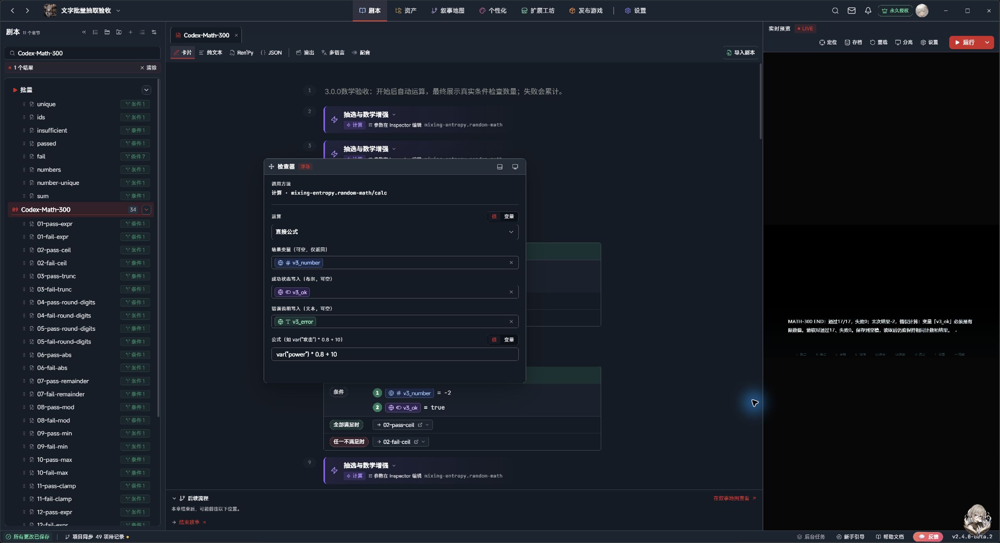

# 抽选与数学增强 3.0.0

**让剧本充满变数，让每次游玩都有独特体验**

**由原「随机与计算系统」升级而来。** 这是同一插件的3.0.0更新：沿用稳定ID `mixing-entropy.random-math`，旧调用继续兼容。已有工程升级前请先备份，迁移边界见下方说明。

为 LetsGal Studio 剧情编排准备的抽取池与计算工具。配置候选、权重和条件，在剧情中抽取、调整，或交给玩家选择。

## 六个清晰的入口

|入口|用途|
|---|---|
|随机数|范围整数、小数、单次或批量，自定义骰子面数|
|放回抽取|从池中抽取，候选保留，可重复出现|
|不放回抽取|按份数消耗，支持先占用、后确认或取消|
|调整抽取池|增删、启停、修改权重/概率/份数，批量调整与读取状态|
|玩家选项|展示合格候选，沿用工程 Choice 界面|
|计算|算术、安全公式、表函数、取整精度、取模和范围限制|

选定操作后显示对应字段，可选执行反馈收进高级设置；已有绑定在收起后仍然生效。

## 把变化放进剧情

**概率随变量变化。** 权重可填写数值变量公式，候选用布尔条件控制参与；筛选后重新计算实际概率。剧情也可以直接调整运行中的池。

**有限次数明确管理。** 不放回池支持同候选多份、按候选或按每份计权。延后消耗用凭证连接抽取与事件完成，避免提前扣掉机会。

**选项使用项目自己的界面。** 候选交给玩家选择，输出稳定 ID 与结果。Choice 布局可在官方 UI 编辑器中编排。

**常用计算直接填写。** 例如 `var("攻击") * 0.8 + 10`；另有指定小数位、绝对值、余数、非负取模、最小/最大值及范围限制。骰子范围可自定，1～20就是二十面骰。

## 界面示例

上图为插件3.0.0的真实原生表单；顶部横幅为宣传插画。下图为3.0.0-rc.5在同一宿主版本中的项目Choice长文本示例，保留其版本标注。

## 随包资料与升级

完整插件、人类手册、离线HTML、给AI读取的Skill、预览式安装助手和迁移工具分别提供。创作者先看[使用手册](USER-GUIDE.md)；AI接入步骤看[安装说明](AI-INTEGRATION.md)。图片来源见[宣传素材说明](PROMO-ASSETS.md)。

稳定ID `mixing-entropy.random-math` 保持。旧调用继续兼容；离线迁移先预览、备份与校验，无法证明等价的调用保留。已有作品先备份工程及升级前存档，具体见[迁移与回退](MIGRATION-3.0.md)。

## 使用范围

允许读档重抽与同一进度固定按池选择；固定结果以已建立的池状态为边界，随机不保证每次不同。复杂条件由外部计算为布尔变量，本插件不包含完整世界状态系统。

主要验证环境为Studio2.4.0-beta.2与Windows。Stable完整版本尚未核定，Web/Android未验证；具体覆盖和已知限制见[验证说明](VALIDATION-3.0.md)。
